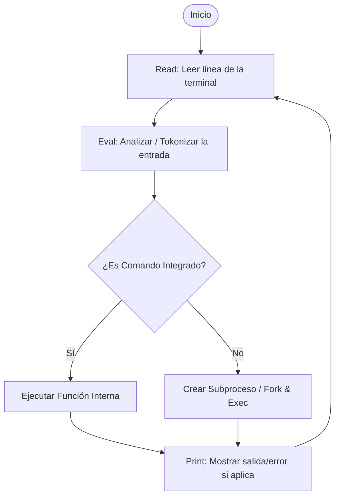

# Guía de Implementación del Shell

Esta guía describe los fundamentos arquitectónicos, patrones de diseño y detalles a nivel de sistema necesarios para construir un shell POSIX-like desde cero.

---

## 🏛️ Arquitectura del Shell: El ciclo REPL

Cualquier intérprete de comandos se estructura en torno a un ciclo **REPL** (Read-Eval-Print Loop):



1. **Read (Lectura)**: Lee bytes desde `stdin`. Para funciones avanzadas (como autocompletado e historial), el shell debe configurar la terminal en **Modo Raw** para procesar carácter a carácter.
2. **Eval (Evaluación)**:
   - **Tokenizador/Analizador**: Convierte una cadena de caracteres en una lista de argumentos (e.g. `"echo "hola mundo""` -> `["echo", "hola mundo"]`), aplicando reglas de comillas y escapes.
   - **Resolución**: Determina si el comando es un *built-in* (dentro del ejecutable del shell) o un *programa externo* (buscando en los directorios del `$PATH`).
   - **Redirección y Pipelines**: Configura descriptores de archivos antes de la ejecución.
   - **Ejecución**: Ejecuta el comando de manera síncrona o asíncrona.
3. **Print (Impresión)**: Muestra la salida del programa ejecutable (o errores) y actualiza el código de salida (`$?`).
4. **Loop (Bucle)**: Vuelve a mostrar el prompt e inicia de nuevo.

---

## 🔍 Tokenización y Análisis Sintáctico (Parsing)

El parsing de comandos no puede ser una simple división por espacios (`split(" ")`), debido a que se debe dar soporte a comillas y escapes.

### Reglas de Tokenización

- **Espacios en Blanco**: Actúan como delimitadores de argumentos, a menos que estén escapados o dentro de comillas.
- **Comillas Simples (`'`)**: Preservan el valor literal de todos los caracteres. Ninguna expansión o escape tiene efecto dentro de ellas.
- **Comillas Dobles (`"`)**: Preservan la mayoría de los caracteres, pero permiten la expansión de variables (`$`) y respetan la barra invertida (`\`) solo cuando precede a `$`, `"`, `\` o `\n`.
- **Barra Invertida (`\`)**: Escapa el siguiente carácter, quitándole cualquier significado especial.

### Diseño Recomendado del Analizador

Se aconseja implementar una máquina de estados sencilla (FSM) que recorra la cadena carácter por carácter:
- **Estados**: `DEFAULT` (normal), `IN_SINGLE_QUOTES` (dentro de comillas simples), `IN_DOUBLE_QUOTES` (dentro de comillas dobles).
- **Escape Flag**: Un booleano `escaped` que se activa al encontrar una barra invertida `\` (dependiendo de las reglas del estado actual) y aplica al siguiente carácter.

---

## ⚙️ Ejecución de Procesos y Gestión de Entorno

### Ejecución de Comandos Externos
Para ejecutar comandos que no están integrados en el shell (e.g. `ls`, `cat`, `grep`), se requiere la creación de un nuevo proceso:

1. **`fork()`**: Duplica el proceso actual.
   - En el **proceso hijo**, el valor de retorno es `0`.
   - En el **proceso padre**, el valor de retorno es el ID de proceso (`PID`) del hijo.
2. **`execvp(file, argv)`** (o funciones similares en otros lenguajes):
   - Reemplaza la imagen del proceso hijo con el nuevo programa.
   - Busca en las rutas listadas en la variable de entorno `$PATH` de manera automática si `file` no contiene una barra diagonal `/`.
3. **`waitpid(pid, &status, options)`**:
   - El padre bloquea su ejecución hasta que el proceso hijo finalice (para comandos normales).
   - Captura el código de salida del hijo para actualizar la variable de estado `$status`.

> [!IMPORTANT]
> Si `execvp` falla (e.g. comando no encontrado o sin permisos de ejecución), el proceso hijo debe llamar inmediatamente a `exit(127)` para evitar la duplicación infinita del REPL del shell en subprocesos.

---

## 🔄 Redirecciones y Pipes

### Descriptores de Archivos (File Descriptors)
Cada proceso tiene por defecto tres descriptores de archivo abiertos:
- `0`: Entrada Estándar (`stdin`)
- `1`: Salida Estándar (`stdout`)
- `2`: Error Estándar (`stderr`)

### Redirección
Para desviar el flujo de salida/entrada hacia un archivo:
1. Abrir el archivo con los flags correctos (`O_WRONLY`, `O_CREAT`, y `O_TRUNC` para `>` o `O_APPEND` para `>>`).
2. Usar **`dup2(oldfd, newfd)`**: Reemplaza el descriptor de archivo `newfd` (e.g. `1` para stdout) con una copia de `oldfd` (el descriptor del archivo abierto).
3. Cerrar el descriptor temporal `oldfd`.
4. Ejecutar `execvp`.

### Pipelines (Tuberías)
Una tubería `A | B` conecta la salida de `A` con la entrada de `B`:

```
          +-------------+              +-------------+
          |  Proceso A  |              |  Proceso B  |
          |  (Escritor) |              |  (Lector)   |
          |             |              |             |
          |   stdout    |              |    stdin    |
          +------|------+              +------|------+
                 |                            ^
                 |      +--------------+      |
                 +----->|  pipefd[1]   |      |
                        | (Escritura)  |      |
                        +--------------+      |
                               |              |
                               v              |
                        +--------------+      |
                        |  pipefd[0]   |------+
                        |   (Lectura)  |
                        +--------------+
```

1. Crear un pipe usando **`pipe(pipefd)`**. Esto retorna dos descriptores: `pipefd[0]` (lectura) y `pipefd[1]` (escritura).
2. Hacer `fork()` para el proceso A. En el hijo de A:
   - Reemplazar stdout (`1`) con `pipefd[1]` usando `dup2`.
   - Cerrar ambos extremos del pipe `pipefd[0]` y `pipefd[1]`.
   - Ejecutar el comando A.
3. Hacer `fork()` para el proceso B. En el hijo de B:
   - Reemplazar stdin (`0`) con `pipefd[0]` usando `dup2`.
   - Cerrar ambos extremos del pipe `pipefd[0]` y `pipefd[1]`.
   - Ejecutar el comando B.
4. En el proceso padre (shell):
   - Cerrar ambos extremos del pipe en su propio proceso para que el extremo lector reciba un indicador de fin de archivo (`EOF`) cuando el escritor termine.
   - Esperar a que ambos procesos finalicen usando `waitpid`.

---

## ⌨️ Modo Raw y Terminal Interactiva

Por defecto, la terminal funciona en **Modo Canónico** (buffered por líneas). El shell no recibe caracteres hasta que el usuario pulsa Enter.
Para implementar autocompletado interactivo (`Tab`) e historial (`↑`/`↓`):

1. **Guardar configuración original**: Obtener los atributos actuales usando la estructura `termios` (`tcgetattr`).
2. **Modificar flags**: Desactivar el modo canónico (`ICANON`) y el eco local (`ECHO`).
3. **Aplicar cambios**: Usar `tcsetattr` con `TCSANOW`.
4. **Restaurar al salir**: Es crítico registrar un manejador de señales y bloques `finally`/`defer` para restaurar los atributos originales de la terminal, de lo contrario la terminal del usuario quedará corrompida tras cerrar el programa.

---

## 👥 Control de Trabajos (Job Control)

Cuando se ejecuta un comando en segundo plano (`&`):
1. **No bloquear al padre**: No llamar a `waitpid` de manera síncrona. Registrar el proceso en una estructura interna de trabajos (Jobs List).
2. **Señales**: Evitar que el proceso en segundo plano reciba señales de interrupción (`Ctrl+C`, `Ctrl+Z`) destinadas al shell. Esto se hace creando un nuevo grupo de procesos mediante `setpgid(0, 0)` en el hijo antes de hacer el `exec`.
3. **Manejo de Zombie Processes**: Monitorear subprocesos asíncronos mediante llamadas periódicas no-bloqueantes a `waitpid(-1, &status, WNOHANG)` en el ciclo REPL para liberar recursos de procesos hijos terminados.
