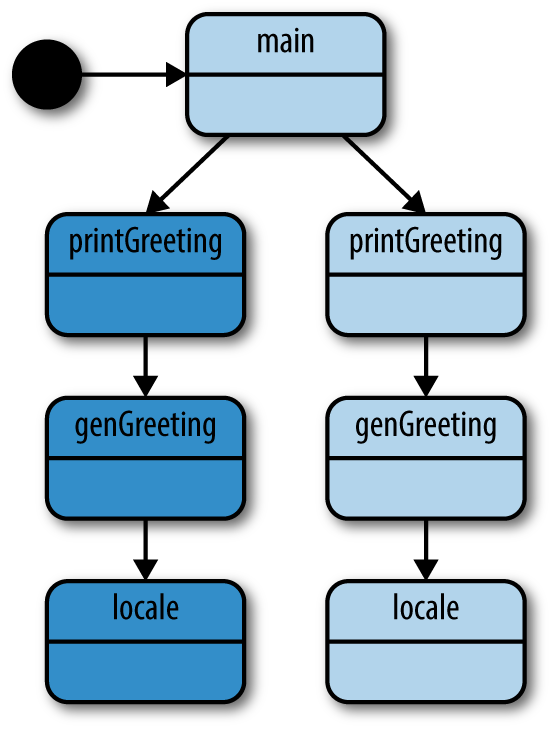
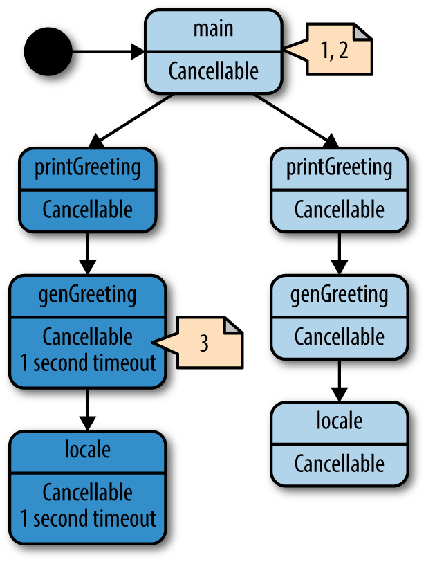

# Capítulo 4: Patrones de Concurrencia en Go

Hemos explorado los fundamentos de las primitivas de concurrencia de Go y discutido cómo usar adecuadamente estas primitivas. En este capítulo, haremos una inmersión profunda en cómo componer estas primitivas en patrones que ayudarán a mantener tu sistema escalable y mantenible.

Sin embargo, antes de comenzar, debemos tocar el formato de algunos de los patrones contenidos en este capítulo. En muchos de los ejemplos, usaremos canales que pasan interfaces vacías (`interface{}`). El uso de interfaces vacías en Go es controvertido; sin embargo, lo he hecho por un par de razones. La primera es que facilita la escritura de ejemplos concisos en el resto del libro. La segunda es que, en algunos casos, creo que esto representa mejor lo que el patrón intenta lograr. Discutiremos este punto más directamente en la sección "Pipelines".

Si esto es demasiado polémico para ti, recuerda que siempre puedes crear generadores de Go para este código y generar los patrones para utilizar el tipo que te interese.

Dicho esto, ¡sumerjámonos y aprendamos sobre algunos patrones de concurrencia en Go!

## Confinamiento (Confinement)

Al trabajar con código concurrente, hay algunas opciones diferentes para una operación segura. Hemos repasado dos de ellas:

- Primitivas de sincronización para compartir memoria (ej., `sync.Mutex`)
- Sincronización mediante comunicación (ej., canales)

Sin embargo, hay un par de otras opciones que son implícitamente seguras dentro de múltiples procesos concurrentes:

- Datos inmutables
- Datos protegidos por confinamiento

En cierto sentido, los datos inmutables son ideales porque son implícitamente seguros para la concurrencia. Cada proceso concurrente puede operar sobre los mismos datos, pero no puede modificarlos. Si quiere crear nuevos datos, debe crear una nueva copia de los datos con las modificaciones deseadas. Esto permite no solo una carga cognitiva más ligera para el desarrollador, sino que también puede conducir a programas más rápidos si lleva a secciones críticas más pequeñas (o las elimina por completo). En Go, puedes lograr esto escribiendo código que utilice copias de valores en lugar de punteros a valores en memoria. Algunos lenguajes admiten la utilización de punteros con valores explícitamente inmutables; sin embargo, Go no se encuentra entre ellos.

El confinamiento también puede permitir una carga cognitiva más ligera para el desarrollador y secciones críticas más pequeñas. Las técnicas para confinar valores concurrentes son un poco más complejas que simplemente pasar copias de valores, por lo que en este capítulo exploraremos estas técnicas de confinamiento en profundidad.

El confinamiento es la idea simple pero poderosa de garantizar que la información solo esté disponible desde *un* proceso concurrente. Cuando se logra esto, un programa concurrente es implícitamente seguro y no se necesita sincronización. Hay dos tipos de confinamiento posibles: ad hoc y léxico.

El confinamiento ad hoc es cuando logras el confinamiento a través de una convención, ya sea establecida por la comunidad del lenguaje, el grupo en el que trabajas o el código base en el que trabajas. En mi opinión, apegarse a la convención es difícil de lograr en proyectos de cualquier tamaño a menos que tengas herramientas para realizar análisis estáticos en tu código cada vez que alguien hace un commit. Aquí hay un ejemplo de confinamiento ad hoc que demuestra por qué:

```go
data := make([]int, 4)

loopData := func(handleData chan<- int) {
    defer close(handleData)
    for i := range data {
        handleData <- data[i]
    }
}

handleData := make(chan int)
go loopData(handleData)

for num := range handleData {
    fmt.Println(num)
}
```

Podemos ver que el slice de enteros `data` está disponible tanto desde la función `loopData` como desde el bucle sobre el canal `handleData`; sin embargo, por convención solo estamos accediendo a él desde la función `loopData`. Pero a medida que muchas personas tocan el código y los plazos se acercan, se pueden cometer errores, y el confinamiento podría romperse y causar problemas. Como mencioné, una herramienta de análisis estático podría detectar este tipo de problemas, pero el análisis estático en un código base de Go sugiere un nivel de madurez que no muchos equipos alcanzan. Es por eso que prefiero el confinamiento léxico: utiliza al compilador para imponer el confinamiento.

El confinamiento léxico implica usar el alcance léxico para exponer solo los datos y las primitivas de concurrencia correctos para que los utilicen múltiples procesos concurrentes. Hace que sea imposible hacer lo incorrecto. De hecho, ya tocamos este tema en el Capítulo 3. Recuerda la sección sobre canales, que analiza la exposición de solo los aspectos de lectura o escritura de un canal a los procesos concurrentes que los necesitan. Echemos un vistazo a ese ejemplo de nuevo:

```go
chanOwner := func() <-chan int {
    results := make(chan int, 5) // 1
    go func() {
        defer close(results)
        for i := 0; i <= 5; i++ {
            results <- i
        }
    }()
    return results
}

consume := func(results <-chan int) { // 3
    for result := range results {
        fmt.Printf("Received: %v\n", result)
    }
    fmt.Println("Done receiving!")
}

results := chanOwner() // 2
consume(results)
```

1. Aquí instanciamos el canal dentro del alcance léxico de la función `chanOwner`. Esto limita el alcance del aspecto de escritura del canal `results` al cierre definido debajo de él. En otras palabras, *confina* el aspecto de escritura de este canal para evitar que otras goroutines escriban en él.
2. Aquí recibimos el aspecto de lectura del canal y podemos pasarlo al consumidor, que no puede hacer nada más que leer de él. Una vez más, esto confina a la goroutine principal a una vista de solo lectura del canal.
3. Aquí recibimos una copia de solo lectura de un canal `int`. Al declarar que el único uso que requerimos es el acceso de lectura, confinamos el uso del canal dentro de la función `consume` solo a lecturas.

Configurado de esta manera, es imposible utilizar mal los canales en este pequeño ejemplo. Este es un buen preámbulo para el confinamiento, pero probablemente no sea un ejemplo muy interesante ya que los canales son seguros para la concurrencia. Echemos un vistazo a un ejemplo de confinamiento que utiliza una estructura de datos que no es segura para la concurrencia, una instancia de `bytes.Buffer`:

```go
printData := func(wg *sync.WaitGroup, data []byte) {
    defer wg.Done()

    var buff bytes.Buffer
    for _, b := range data {
        fmt.Fprintf(&buff, "%c", b)
    }
    fmt.Println(buff.String())
}

var wg sync.WaitGroup
wg.Add(2)
data := []byte("goläng")
go printData(&wg, data[:3]) // 1
go printData(&wg, data[3:]) // 2

wg.Wait()
```

1. Aquí pasamos un slice que contiene los primeros tres bytes de la estructura `data`.
2. Aquí pasamos un slice que contiene los últimos tres bytes de la estructura `data`.

En este ejemplo, puedes ver que debido a que `printData` no se cierra sobre el slice `data`, no puede acceder a él y necesita recibir un slice de `byte` para operar. Pasamos diferentes subconjuntos del slice, limitando así las goroutines que iniciamos solo a la parte del slice que estamos pasando. Debido al alcance léxico, hemos hecho imposible hacer lo incorrecto, por lo que no necesitamos sincronizar el acceso a la memoria ni compartir datos a través de la comunicación.

Entonces, ¿cuál es el punto? ¿Por qué buscar el confinamiento si tenemos la sincronización disponible? La respuesta es un mejor rendimiento y una menor carga cognitiva para los desarrolladores. La sincronización tiene un costo, y si puedes evitarla no tendrás secciones críticas y, por lo tanto, no tendrás que pagar el costo de sincronizarlas. También esquivas toda una clase de problemas posibles con la sincronización; los desarrolladores simplemente no tienen que preocuparse por estos problemas. El código concurrente que utiliza el confinamiento léxico también tiene el beneficio de ser generalmente más sencillo de entender que el código concurrente sin variables confinadas léxicamente. Esto se debe a que, dentro del contexto de tu alcance léxico, puedes escribir código síncrono.

Dicho esto, puede ser difícil establecer el confinamiento, por lo que a veces tenemos que recurrir a nuestras maravillosas primitivas de concurrencia de Go.

## El bucle for-select

Algo que verás una y otra vez en los programas de Go es el bucle for-select. No es más que algo como esto:

```go
for { // Bucle infinito o iteración sobre un rango
    select {
    // Haz algo con los canales
    }
}
```

Hay un par de escenarios diferentes donde verás aparecer este patrón.

### Envío de variables de iteración a través de un canal

A menudo querrás convertir algo que se puede iterar en valores en un canal. Esto no es nada del otro mundo y suele verse así:

```go
for _, s := range []string{"a", "b", "c"} {
    select {
    case <-done:
        return
    case stringStream <- s:
    }
}
```

### Bucle infinito esperando ser detenido

Es muy común crear goroutines que se ejecutan en bucle infinito hasta que se detienen. Hay un par de variaciones de esto. Cuál elijas es puramente una preferencia de estilo.

La primera variación mantiene la declaración `select` lo más corta posible:

```go
for {
    select {
    case <-done:
        return
    default:
    }

    // Hacer trabajo no bloqueante
}
```

Si el canal `done` no está cerrado, saldremos de la declaración `select` y continuaremos con el resto del cuerpo de nuestro bucle `for`.

La segunda variación integra el trabajo en una cláusula `default` de la declaración `select`:

```go
for {
    select {
    case <-done:
        return
    default:
        // Hacer trabajo no bloqueante
    }
}
```

Cuando entramos en la declaración `select`, si el canal `done` no se ha cerrado, ejecutaremos la cláusula `default` en su lugar.

No hay nada más en este patrón, pero aparece por todas partes, por lo que vale la pena mencionarlo.

## Prevención de fugas de Goroutine (Goroutine Leaks)

Como cubrimos en la sección "Goroutines", sabemos que las goroutines son baratas y fáciles de crear; es una de las cosas que hace que Go sea un lenguaje tan productivo. El entorno de ejecución se encarga de multiplexar las goroutines en cualquier cantidad de hilos del sistema operativo para que a menudo no tengamos que preocuparnos por ese nivel de abstracción. Pero *tienen* un costo de recursos, y las goroutines no son recolectadas por el recolector de basura del runtime, por lo que independientemente de cuán pequeña sea su huella de memoria, no queremos dejarlas tiradas por nuestro proceso. Entonces, ¿cómo hacemos para asegurar que se limpien?

Empecemos por el principio y pensemos en esto paso a paso: ¿por qué existiría una goroutine? En el Capítulo 2, establecimos que las goroutines representan unidades de trabajo que pueden o no ejecutarse en paralelo entre sí. La goroutine tiene algunas rutas de terminación:

- Cuando ha completado su trabajo.
- Cuando no puede continuar su trabajo debido a un error irrecuperable.
- Cuando se le dice que deje de trabajar.

Obtenemos las dos primeras rutas de forma gratuita (estas rutas son tu algoritmo), pero ¿qué pasa con la cancelación del trabajo? Esto resulta ser la parte más importante debido al efecto de red: si has comenzado una goroutine, lo más probable es que esté cooperando con otras goroutines de alguna manera organizada. Incluso podríamos representar esta interconexión como un gráfico: si una goroutine hija debe continuar ejecutándose o no, podría basarse en el conocimiento del estado de muchas *otras* goroutines. La goroutine padre (a menudo la goroutine principal) con este conocimiento contextual completo debería ser capaz de decirles a sus goroutines hijas que terminen. Continuaremos analizando la interdependencia de goroutines a gran escala en el próximo capítulo, pero por ahora consideremos cómo asegurar que una sola goroutine hija se limpie garantizadamente. Comencemos con un ejemplo simple de una fuga de goroutine:

```go
doWork := func(strings <-chan string) <-chan interface{} {
    completed := make(chan interface{})
    go func() {
        defer fmt.Println("doWork exited.")
        defer close(completed)
        for s := range strings {
            // Haz algo interesante
            fmt.Println(s)
        }
    }()
    return completed
}

doWork(nil)
// Haz un poco de trabajo
fmt.Println("Done.")
```

Aquí vemos que la goroutine principal pasa un canal nulo a `doWork`. Por lo tanto, el canal `strings` nunca recibirá ninguna cadena escrita en él, y la goroutine que contiene `doWork` permanecerá en la memoria durante la vida de este proceso (incluso nos interbloquearíamos si uniéramos la goroutine dentro de `doWork` y la goroutine principal).

En este ejemplo, la vida del proceso es muy corta, pero en un programa real, las goroutines podrían iniciarse fácilmente al comienzo de un programa de larga duración. En el peor de los casos, la goroutine principal podría *continuar* activando goroutines a lo largo de su vida, causando un aumento sigiloso en la utilización de la memoria.

La forma de mitigar esto con éxito es establecer una señal entre la goroutine padre y sus hijas que permita al padre señalar la cancelación a sus hijas. Por convención, esta señal suele ser un canal de solo lectura llamado `done`. La goroutine padre pasa este canal a la goroutine hija y luego cierra el canal cuando quiere cancelar la goroutine hija. Aquí hay un ejemplo:

```go
doWork := func(
    done <-chan interface{}, // 1
    strings <-chan string,
) <-chan interface{} {
    terminated := make(chan interface{})
    go func() {
        defer fmt.Println("doWork exited.")
        defer close(terminated)
        for {
            select {
            case s := <-strings:
                // Haz algo interesante
                fmt.Println(s)
            case <-done: // 2
                return
            }
        }
    }()
    return terminated
}

done := make(chan interface{})
terminated := doWork(done, nil)

go func() { // 3
    // Cancela la operación después de 1 segundo
    time.Sleep(1 * time.Second)
    fmt.Println("Canceling doWork goroutine...")
    close(done)
}()

<-terminated // 4
fmt.Println("Done.")
```

1. Aquí pasamos el canal `done` a la función `doWork`. Por convención, este canal es el primer parámetro.
2. En esta línea vemos el omnipresente patrón for-select en uso. Una de nuestras sentencias case está comprobando si se ha señalado nuestro canal `done`. Si es así, retornamos de la goroutine.
3. Aquí creamos otra goroutine que cancelará la goroutine generada en `doWork` si pasa más de un segundo.
4. Aquí es donde unimos la goroutine generada por `doWork` con la goroutine principal.

Y la salida resultante es:

```text
Canceling doWork goroutine...
doWork exited.
Done.
```

Puedes ver que a pesar de pasar `nil` para nuestro canal `strings`, nuestra goroutine aún sale con éxito. A diferencia del ejemplo anterior, en este ejemplo *sí* unimos las dos goroutines y, sin embargo, no recibimos un interbloqueo. Esto se debe a que antes de unir las dos goroutines, creamos una tercera goroutine para cancelar la goroutine dentro de `doWork` después de un segundo. ¡Hemos eliminado con éxito nuestra fuga de goroutine!

El ejemplo anterior maneja bien el caso de las goroutines que reciben en un canal, pero ¿qué pasa si estamos tratando con la situación inversa: una goroutine bloqueada al intentar escribir un valor en un canal? Aquí hay un ejemplo rápido para demostrar el problema:

```go
newRandStream := func(done <-chan interface{}) <-chan int {
    randStream := make(chan int)
    go func() {
        defer fmt.Println("newRandStream closure exited.") // 1
        defer close(randStream)
        for {
            select {
            case randStream <- rand.Int():
            case <-done:
                return
            }
        }
    }()

    return randStream
}

done := make(chan interface{})
randStream := newRandStream(done)
fmt.Println("3 random ints:")
for i := 1; i <= 3; i++ {
    fmt.Printf("%d: %d\n", i, <-randStream)
}
close(done)

// Simula trabajo en curso
time.Sleep(1 * time.Second)
```

1. Aquí imprimimos un mensaje cuando la goroutine termina con éxito.

La ejecución de este código produce:

```text
3 random ints:
1: 5577006791947779410
2: 8674665223082153551
3: 6129484611666145821
newRandStream closure exited.
```

Vemos ahora que la goroutine se está limpiando correctamente. Si no hubiéramos pasado el canal `done` y no lo hubiéramos cerrado, la instrucción `fmt.Println` diferida nunca se habría ejecutado porque la goroutine se habría quedado bloqueada intentando enviar el siguiente entero aleatorio a un canal que ya no se estaba leyendo.

Ahora que sabemos cómo asegurar que las goroutines no se filtren, podemos estipular una convención: *Si una goroutine es responsable de crear una goroutine, también es responsable de asegurar que puede detener la goroutine.*

Esta convención ayudará a garantizar que tus programas sean componibles y escalen a medida que crecen. Volveremos a esta técnica y regla en las secciones "Pipelines" y "El paquete context". La forma en que nos aseguramos de que las goroutines se puedan detener puede diferir según el tipo y el propósito de la goroutine, pero todas se basan en la base de pasar un canal `done`.

## El or-channel

A veces puedes encontrarte queriendo combinar uno o más canales `done` en un solo canal `done` que se cierre si alguno de sus canales componentes se cierra. Es perfectamente aceptable, aunque verboso, escribir una declaración `select` que realice este acoplamiento; sin embargo, a veces no puedes saber el número de canales `done` con los que estás trabajando en tiempo de ejecución. En este caso, o si simplemente prefieres una sola línea, puedes combinar estos canales utilizando el patrón *or-channel*.

Este patrón crea un canal `done` compuesto a través de la recursividad y las goroutines. Echemos un vistazo:

```go
var or func(channels ...<-chan interface{}) <-chan interface{}
or = func(channels ...<-chan interface{}) <-chan interface{} { // 1
    switch len(channels) {
    case 0: // 2
        return nil
    case 1: // 3
        return channels[0]
    }

    orDone := make(chan interface{})
    go func() { // 4
        defer close(orDone)

        switch len(channels) {
        case 2: // 5
            select {
            case <-channels[0]:
            case <-channels[1]:
            }
        default: // 6
            select {
            case <-channels[0]:
            case <-channels[1]:
            case <-channels[2]:
            case <-or(append(channels[3:], orDone)...):
            }
        }
    }()
    return orDone
}
```

1. Aquí tenemos nuestra función `or`, que recibe un slice variádico de canales y devuelve un único canal.
2. Dado que esta es una función recursiva, debemos establecer criterios de terminación. El primero es que si el slice variádico está vacío, simplemente devolvemos un canal nulo. Esto es consistente con la idea de no pasar canales; no esperaríamos que un canal compuesto hiciera nada.
3. Nuestro segundo criterio de terminación establece que si nuestro slice variádico solo contiene un elemento, simplemente devolvemos ese elemento.
4. Aquí está el cuerpo principal de la función, y donde ocurre la recursividad. Creamos una goroutine para que podamos esperar mensajes en nuestros canales sin bloquear.
5. Debido a cómo estamos haciendo la recursión, cada llamada recursiva a `or` tendrá al menos dos canales. Como optimización para mantener limitado el número de goroutines, colocamos un caso especial aquí para llamadas a `or` con solo dos canales.
6. Aquí creamos recursivamente un or-channel a partir de todos los canales en nuestro slice después del tercer índice, y luego seleccionamos de este. Esta relación de recurrencia desestructurará el resto del slice en or-channels para formar un árbol desde el cual regresará la primera señal. También pasamos el canal `orDone` para que cuando las goroutines suban por el árbol salgan, las goroutines que bajan por el árbol también salgan.

Esta es una función bastante concisa que te permite combinar cualquier número de canales en un solo canal que se cerrará tan pronto como cualquiera de sus canales componentes se cierre o se escriba en él. Echemos un vistazo a cómo podemos usar esta función:

```go
sig := func(after time.Duration) <-chan interface{} { // 1
    c := make(chan interface{})
    go func() {
        defer close(c)
        time.Sleep(after)
    }()
    return c
}

start := time.Now() // 2
<-or(
    sig(2*time.Hour),
    sig(5*time.Minute),
    sig(1*time.Second),
    sig(1*time.Hour),
    sig(1*time.Minute),
)
fmt.Printf("done after %v", time.Since(start)) // 3
```

1. Esta función simplemente crea un canal que se cerrará cuando transcurra el tiempo especificado en `after`.
2. Aquí hacemos un seguimiento de aproximadamente cuándo comienza a bloquearse el canal de la función `or`.
3. Y aquí imprimimos el tiempo que tardó en ocurrir la lectura.

Si ejecutas este programa obtendrás:

```text
done after 1.000216772s
```

Observa que a pesar de colocar varios canales en nuestra llamada a `or` que tardan varios tiempos en cerrarse, nuestro canal que se cierra después de un segundo hace que se cierre todo el canal creado por la llamada a `or`. Esto se debe a que, a pesar de su lugar en el árbol que construye la función `or`, siempre se cerrará primero y, por lo tanto, los canales que dependen de su cierre también se cerrarán.

Logramos esta brevedad a costa de goroutines adicionales, f(x)=⌊x/2⌋ donde `x` es el número de canales, pero recuerda que una de las fortalezas de Go es la capacidad de crear, programar y ejecutar goroutines rápidamente, y el lenguaje fomenta activamente el uso de goroutines para modelar problemas correctamente. Preocuparse por la cantidad de goroutines creadas aquí es probablemente una optimización prematura. Además, si en el momento de la compilación no sabes con cuántos canales `done` estás trabajando, no hay otra forma de combinar canales `done`.

Este patrón es útil para emplear en la intersección de módulos en tu sistema. En estas intersecciones, tiendes a tener múltiples condiciones para cancelar árboles de goroutines a través de tu pila de llamadas. Usando la función `or`, simplemente puedes combinarlas y pasarlas hacia abajo en la pila. Echaremos un vistazo a otra forma de hacer esto en "El paquete context" que también es muy agradable, y quizás un poco más descriptiva.

## Manejo de Errores

En los programas concurrentes, el manejo de errores puede ser difícil de realizar correctamente. A veces, pasamos tanto tiempo pensando en cómo nuestros diversos procesos compartirán información y se coordinarán, que nos olvidamos de considerar cómo manejarán con elegancia los estados de error. Cuando Go rechazó el popular modelo de excepción para errores, hizo una declaración de que el manejo de errores era importante y que, a medida que desarrollamos nuestros programas, debemos prestar a nuestras rutas de error la misma atención que prestamos a nuestros algoritmos. Con ese espíritu, echemos un vistazo a cómo hacemos eso cuando trabajamos con múltiples procesos concurrentes.

La pregunta más fundamental cuando se piensa en el manejo de errores es: "¿Quién debería ser responsable de manejar el error?". En algún momento, el programa debe dejar de pasar el error por la pila y realmente hacer algo con él. ¿Qué es responsable de esto?

Con procesos concurrentes, esta pregunta se vuelve un poco más compleja. Debido a que un proceso concurrente está operando independientemente de su padre o hermanos, puede ser difícil para él razonar sobre qué es lo correcto para hacer con el error. Echa un vistazo al siguiente código para ver un ejemplo de este problema:

```go
checkStatus := func(
    done <-chan interface{},
    urls ...string,
) <-chan *http.Response {
    responses := make(chan *http.Response)
    go func() {
        defer close(responses)
        for _, url := range urls {
            resp, err := http.Get(url)
            if err != nil {
                fmt.Println(err) // 1
                continue
            }
            select {
            case <-done:
                return
            case responses <- resp:
            }
        }
    }()
    return responses
}

done := make(chan interface{})
defer close(done)

urls := []string{"https://www.google.com", "https://badhost"}
for response := range checkStatus(done, urls...) {
    fmt.Printf("Response: %v\n", response.Status)
}
```

1. Aquí vemos a la goroutine haciendo todo lo posible para señalar que hay un error. ¿Qué más puede hacer? ¡No puede devolverlo! ¿Cuántos errores son demasiados? ¿Sigue haciendo peticiones?

La ejecución de este código produce:

```text
Response: 200 OK
Get https://badhost: dial tcp: lookup badhost on 127.0.1.1:53: no such host
```

Aquí vemos que la goroutine no ha tenido otra opción en el asunto. No puede simplemente tragarse el error, por lo que hace lo único sensato: imprime el error y espera que algo esté prestando atención. No pongas a tus goroutines en esta posición incómoda. Sugiero que separes tus preocupaciones: en general, tus procesos concurrentes deberían enviar sus errores a otra parte de tu programa que tenga información completa sobre el estado de tu programa y pueda tomar una decisión más informada sobre qué hacer. El siguiente ejemplo demuestra una solución correcta a este problema:

```go
type Result struct { // 1
    Error    error
    Response *http.Response
}

checkStatus := func(
    done <-chan interface{},
    urls ...string,
) <-chan Result { // 2
    results := make(chan Result)
    go func() {
        defer close(results)

        for _, url := range urls {
            var result Result
            resp, err := http.Get(url)
            result = Result{Error: err, Response: resp} // 3
            select {
            case <-done:
                return
            case results <- result: // 4
            }
        }
    }()
    return results
}

done := make(chan interface{})
defer close(done)

urls := []string{"https://www.google.com", "https://badhost"}
for result := range checkStatus(done, urls...) {
    if result.Error != nil { // 5
        fmt.Printf("error: %v\n", result.Error)
        continue
    }
    fmt.Printf("Response: %v\n", result.Response.Status)
}
```

1. Aquí creamos un tipo que abarca tanto el `*http.Response` como el `error` posible de una iteración del bucle dentro de nuestra goroutine.
2. Esta línea devuelve un canal que se puede leer para recuperar los resultados de una iteración de nuestro bucle.
3. Aquí creamos una instancia de `Result` con los campos `Error` y `Response` establecidos.
4. Aquí es donde escribimos el `Result` en nuestro canal.
5. Aquí, en nuestra goroutine principal, podemos lidiar con los errores que salen de la goroutine iniciada por `checkStatus` de manera inteligente y con el contexto completo del programa más grande.

Este código produce:

```text
Response: 200 OK
error: Get https://badhost: dial tcp: lookup badhost on 127.0.1.1:53: no such host
```

El punto clave a tener en cuenta aquí es cómo hemos acoplado el resultado potencial con el error potencial. Esto representa el conjunto completo de resultados posibles creados a partir de la goroutine `checkStatus` y permite a nuestra goroutine principal tomar decisiones sobre qué hacer cuando ocurren errores. En términos más generales, hemos separado con éxito las preocupaciones del manejo de errores de nuestra goroutine productora. Esto es deseable porque la goroutine que generó la goroutine productora —en este caso, nuestra goroutine principal— tiene más contexto sobre el programa en ejecución y puede tomar decisiones más inteligentes sobre qué hacer con los errores.

En el ejemplo anterior, simplemente escribimos errores en `stdio`, pero podríamos hacer algo más. Alteremos nuestro programa ligeramente para que deje de intentar verificar el estado si ocurren tres o más errores:

```go
done := make(chan interface{})
defer close(done)

errCount := 0
urls := []string{"a", "https://www.google.com", "b", "c", "d"}
for result := range checkStatus(done, urls...) {
    if result.Error != nil {
        fmt.Printf("error: %v\n", result.Error)
        errCount++
        if errCount >= 3 {
            fmt.Println("Too many errors, breaking!")
            break
        }
        continue
    }
    fmt.Printf("Response: %v\n", result.Response.Status)
}
```

Este código produce esta salida:

```text
error: Get a: unsupported protocol scheme ""
Response: 200 OK
error: Get b: unsupported protocol scheme ""
error: Get c: unsupported protocol scheme ""
Too many errors, breaking!
```

Puedes ver que debido a que los errores se devuelven desde `checkStatus` y no se manejan internamente dentro de la goroutine, el manejo de errores sigue el patrón familiar de Go. Este es un ejemplo simple, pero no es difícil imaginar situaciones en las que la goroutine principal coordina resultados de múltiples goroutines y crea reglas más complejas para continuar o cancelar goroutines hijas. Una vez más, la conclusión principal aquí es que los errores deben considerarse ciudadanos de primera clase al construir valores para devolver de las goroutines. Si tu goroutine puede producir errores, esos errores deben estar estrechamente vinculados con tu tipo de resultado y pasarse a través de las mismas líneas de comunicación, al igual que las funciones sincrónicas regulares.

## Pipelines

Cuando escribes un programa, probablemente no te sientas a escribir una función larga, ¡al menos espero que no lo hagas! Construyes abstracciones en forma de funciones, structs, métodos, etc. ¿Por qué hacemos esto? En parte para abstraer detalles que no importan al flujo general, y en parte para que podamos trabajar en un área de código sin afectar a otras áreas. ¿Alguna vez has tenido que hacer un cambio en un sistema y te has encontrado con que has tenido que tocar múltiples áreas solo para hacer un cambio lógico? Podría ser porque ese sistema sufre de una mala abstracción.

Un *pipeline* (tubería) es solo otra herramienta que puedes usar para formar una abstracción en tu sistema. En particular, es una herramienta muy poderosa para usar cuando tu programa necesita procesar flujos (streams) o lotes (batches) de datos. Se cree que la palabra pipeline se usó por primera vez en 1856 y probablemente se refería a una línea de tuberías que transportaban líquido de un lugar a otro. Tomamos prestado este término en informática porque también estamos transportando algo de un lugar a otro: datos. Un pipeline no es más que una serie de cosas que reciben datos, realizan una operación en ellos y vuelven a enviar los datos. Llamamos a cada una de estas operaciones una *etapa* (stage) del pipeline.

Al usar un pipeline, separas las preocupaciones de cada etapa, lo que proporciona numerosos beneficios. Puedes modificar las etapas independientemente unas de otras, puedes mezclar y combinar cómo se combinan las etapas independientemente de modificar las etapas, puedes procesar cada etapa de forma concurrente con las etapas anteriores o posteriores, y puedes realizar un *fan-out* (reparto) o un *rate-limit* (limitación de tasa) en porciones de tu pipeline. Cubriremos fan-out en la sección "Fan-Out, Fan-In" y cubriremos rate-limiting en el Capítulo 5. No tienes que preocuparte por lo que significan estos términos ahora mismo; comencemos de forma sencilla e intentemos construir una etapa de un pipeline.

Como se mencionó anteriormente, una etapa es solo algo que recibe datos, realiza una transformación en ellos y vuelve a enviar los datos. Aquí hay una función que podría considerarse una etapa de un pipeline:

```go
multiply := func(values []int, multiplier int) []int {
    multipliedValues := make([]int, len(values))
    for i, v := range values {
        multipliedValues[i] = v * multiplier
    }
    return multipliedValues
}
```

Esta función recibe un slice de enteros con un multiplicador, los recorre multiplicando a medida que avanza y devuelve un nuevo slice transformado. Parece una función aburrida, ¿verdad? Creemos otra etapa:

```go
add := func(values []int, additive int) []int {
    addedValues := make([]int, len(values))
    for i, v := range values {
        addedValues[i] = v + additive
    }
    return addedValues
}
```

¡Otra función aburrida! Esta simplemente crea un nuevo slice y añade un valor a cada elemento. En este punto, te estarás preguntando qué hace que estas dos funciones sean etapas de un pipeline y no solo funciones. Intentemos combinarlas:

```go
ints := []int{1, 2, 3, 4}
for _, v := range add(multiply(ints, 2), 1) {
    fmt.Println(v)
}
```

Este código produce:

```text
3
5
7
9
```

Mira cómo combinamos `add` y `multiply` dentro de la cláusula `range`. Estas son funciones como las que usas todos los días, pero debido a que las construimos para que tengan las propiedades de una etapa de pipeline, podemos combinarlas para formar un pipeline. Eso es interesante; ¿cuáles *son* las propiedades de una etapa de pipeline?

- Una etapa consume y devuelve el mismo tipo.
- Una etapa debe ser cosificada (reified) por el lenguaje para que pueda ser pasada de un lado a otro. Las funciones en Go están cosificadas y se ajustan perfectamente a este propósito.

Aquellos de ustedes familiarizados con la programación funcional pueden estar asintiendo con la cabeza y pensando en términos como *funciones de orden superior* (higher order functions) y *mónadas* (monads). De hecho, las etapas de los pipelines están muy estrechamente relacionadas con la programación funcional y pueden considerarse un subconjunto de las mónadas. No profundizaré en las mónadas ni en la programación funcional explícitamente aquí, pero son temas interesantes por derecho propio, y el conocimiento práctico de ambos temas es útil, aunque innecesario, para recurrir a él al tratar de entender los pipelines.

Aquí, nuestras etapas `add` y `multiply` satisfacen todas las propiedades de una etapa de pipeline: ambas consumen un slice de `int` y devuelven un slice de `int`, y como Go tiene funciones cosificadas, podemos pasar `add` y `multiply` de un lado a otro. Estas propiedades dan lugar a las interesantes propiedades de las etapas de pipeline que mencionamos anteriormente: es decir, resulta muy fácil combinar nuestras etapas a un nivel superior sin modificar las etapas mismas.

Por ejemplo, si quisiéramos añadir ahora una etapa adicional a nuestro pipeline para multiplicar por dos, simplemente envolveríamos nuestro pipeline anterior en una nueva etapa `multiply`, de esta manera:

```go
ints := []int{1, 2, 3, 4}
for _, v := range multiply(add(multiply(ints, 2), 1), 2) {
    fmt.Println(v)
}
```

La ejecución de este código produce:

```text
6
10
14
18
```

Observa cómo pudimos hacer esto sin escribir una nueva función, sin modificar ninguna de las existentes, ni modificar lo que hacemos con el resultado de nuestro pipeline. Quizás estés empezando a ver los beneficios de usar el patrón de pipeline. Por supuesto, también podríamos escribir este código de forma procedimental:

```go
ints := []int{1, 2, 3, 4}
for _, v := range ints {
    fmt.Println((v*2 + 1) * 2)
}
```

Inicialmente, esto parece mucho más sencillo, pero como verás a medida que avancemos, el código procedimental no proporciona los mismos beneficios que un pipeline cuando se trata de flujos de datos.

¿Notas cómo cada etapa recibe un slice de datos y devuelve un slice de datos? Estas etapas están realizando lo que llamamos *procesamiento por lotes* (batch processing). Esto solo significa que operan sobre trozos de datos a la vez en lugar de un valor discreto a la vez. Hay otro tipo de etapa de pipeline que realiza el *procesamiento de flujos* (stream processing). Esto significa que la etapa recibe y emite un elemento a la vez.

Hay pros y contras en el procesamiento por lotes frente al procesamiento por flujos, que discutiremos en un momento. Por ahora, observa que para que los datos originales permanezcan inalterados, cada etapa tiene que crear un nuevo slice de igual longitud para almacenar los resultados de sus cálculos. Eso significa que la huella de memoria de nuestro programa en cualquier momento es el doble del tamaño del slice que enviamos al inicio de nuestro pipeline. Convirtamos nuestras etapas para que estén orientadas al flujo y veamos cómo se ve eso:

```go
multiply := func(value, multiplier int) int {
    return value * multiplier
}

add := func(value, additive int) int {
    return value + additive
}

ints := []int{1, 2, 3, 4}
for _, v := range ints {
    fmt.Println(multiply(add(multiply(v, 2), 1), 2))
}
```

Este código produce:

```text
6
10
14
18
```

Cada etapa recibe y emite un valor discreto, y la huella de memoria de nuestro programa ha vuelto a ser solo el tamaño de la entrada del pipeline. Pero tuvimos que bajar el pipeline al cuerpo del bucle `for` y dejar que el `range` hiciera el trabajo pesado de alimentar nuestro pipeline. Esto no solo limita la reutilización de cómo alimentamos el pipeline, sino que, como veremos más adelante en esta sección, también limita nuestra capacidad de escalar. También tenemos otros problemas. Efectivamente, estamos instanciando nuestro pipeline por cada iteración del bucle. Aunque es barato hacer llamadas a funciones, estamos haciendo tres llamadas a funciones por cada iteración del bucle. ¿Y qué pasa con la concurrencia? Dije antes que uno de los beneficios de utilizar pipelines era la capacidad de procesar etapas individuales de forma concurrente, y mencioné algo sobre *fan-out*. ¿Dónde entra todo eso?

Probablemente podría extender nuestras funciones `multiply` y `add` un poco más para introducir estos conceptos, pero ya han cumplido su función de presentar el concepto de pipeline. Es hora de empezar a aprender qué mejores prácticas existen para construir pipelines en Go, y comienza con la primitiva de *canal* de Go.

### Mejores prácticas para la construcción de pipelines

Los canales son idóneos para construir pipelines en Go porque cumplen con todos nuestros requisitos básicos. Pueden recibir y emitir valores, pueden usarse de forma segura concurrentemente, pueden recorrerse con `range` y están cosificados por el lenguaje. Tomémonos un momento y convirtamos el ejemplo anterior para utilizar canales en su lugar:

```go
generator := func(done <-chan interface{}, integers ...int) <-chan int {
    intStream := make(chan int)
    go func() {
        defer close(intStream)
        for _, i := range integers {
            select {
            case <-done:
                return
            case intStream <- i:
            }
        }
    }()
    return intStream
}

multiply := func(
    done <-chan interface{},
    intStream <-chan int,
    multiplier int,
) <-chan int {
    multipliedStream := make(chan int)
    go func() {
        defer close(multipliedStream)
        for i := range intStream {
            select {
            case <-done:
                return
            case multipliedStream <- i * multiplier:
            }
        }
    }()
    return multipliedStream
}

add := func(
    done <-chan interface{},
    intStream <-chan int,
    additive int,
) <-chan int {
    addedStream := make(chan int)
    go func() {
        defer close(addedStream)
        for i := range intStream {
            select {
            case <-done:
                return
            case addedStream <- i + additive:
            }
        }
    }()
    return addedStream
}

done := make(chan interface{})
defer close(done)

intStream := generator(done, 1, 2, 3, 4)
pipeline := multiply(done, add(done, multiply(done, intStream, 2), 1), 2)

for v := range pipeline {
    fmt.Println(v)
}
```

Este código produce:

```text
6
10
14
18
```

Parece que hemos replicado la salida deseada, pero a costa de tener mucho más código. ¿Qué hemos ganado exactamente? Primero, examinemos lo que hemos escrito. Ahora tenemos tres funciones en lugar de dos. Todas parecen iniciar una goroutine dentro de sus cuerpos y utilizan el patrón que establecimos en "Prevención de fugas de Goroutine" de recibir un canal para señalar que la goroutine debe salir. Todas parecen devolver canales, y algunas de ellas parecen recibir un canal adicional también. ¡Interesante! Comencemos a desglosar esto más a fondo:

```go
done := make(chan interface{})
defer close(done)
```

Lo primero que hace nuestro programa es crear un canal `done` y llamar a `close` sobre él en una sentencia `defer`. Como se discutió anteriormente, esto asegura que nuestro programa salga limpiamente y nunca filtre goroutines. Nada nuevo ahí. A continuación, echemos un vistazo a la función `generator`:

```go
generator := func(done <-chan interface{}, integers ...int) <-chan int {
    intStream := make(chan int)
    go func() {
        defer close(intStream)
        for _, i := range integers {
            select {
            case <-done:
                return
            case intStream <- i:
            }
        }
    }()
    return intStream
}
```

La función `generator` recibe un slice variádico de enteros, construye un canal de enteros, inicia una goroutine y devuelve el canal construido. Luego, en la goroutine que se creó, `generator` recorre el slice variádico que se pasó y envía los valores del slice por el canal que creó.

Ten en cuenta que el envío en el canal comparte una declaración `select` con una selección en el canal `done`. De nuevo, este es el patrón que establecimos para protegernos contra las fugas de goroutines.

Así que, en pocas palabras, la función `generator` convierte un conjunto discreto de valores en un flujo (stream) de datos en un canal. Acertadamente, este tipo de función se llama *generador*. Verás esto con frecuencia cuando trabajes con pipelines porque al comienzo del pipeline siempre tendrás algún lote de datos que necesitas convertir a un canal. Repasaremos algunos ejemplos de algunos generadores divertidos en un momento, pero terminemos primero nuestro análisis de este programa. A continuación, construimos nuestro pipeline:

```go
pipeline := multiply(done, add(done, multiply(done, intStream, 2), 1), 2)
```

Es el mismo pipeline con el que hemos estado trabajando todo el tiempo: para un flujo de números, los multiplicaremos por dos, añadiremos uno y luego multiplicaremos el resultado por dos. Este pipeline es similar a nuestro pipeline que utilizaba funciones en el ejemplo anterior, pero es diferente en aspectos muy importantes.

Primero, estamos usando canales. Esto es obvio pero significativo porque permite dos cosas: al final de nuestro pipeline, podemos usar una instrucción `range` para extraer los valores, y en cada etapa podemos ejecutar de forma segura concurrentemente porque nuestras entradas y salidas son seguras en contextos concurrentes.

Lo que nos lleva a nuestra segunda diferencia: cada etapa del pipeline se está ejecutando concurrentemente. Esto significa que cualquier etapa solo necesita esperar sus entradas y poder enviar sus salidas. Esto resulta tener ramificaciones masivas como descubriremos en la sección "Fan-Out, Fan-In", pero por ahora simplemente podemos notar que permite que nuestras etapas se ejecuten independientemente unas de otras durante algún fragmento de tiempo.

Finalmente, en nuestro ejemplo, recorremos este pipeline y los valores se extraen a través del sistema:

```go
for v := range pipeline {
    fmt.Println(v)
}
```

Aquí hay una tabla que demuestra cómo cada uno de los valores en el sistema entrará en cada canal y cuándo se cerrarán los canales. *Iteration* es el recuento basado en cero de en qué iteración del bucle `for` nos encontramos, y el valor de cada columna es el valor a medida que entra en la etapa del pipeline:

| Iteration | Generator | Multiply | Add      | Multiply | Value |
|-----------|-----------|----------|----------|----------|-------|
| 0         | 1         |          |          |          |       |
| 0         |           | 1        |          |          |       |
| 0         | 2         |          | 2        |          |       |
| 0         |           | 2        |          | 3        |       |
| 0         | 3         |          | 4        |          | 6     |
| 1         |           | 3        |          | 5        |       |
| 1         | 4         |          | 6        |          | 10    |
| 2         | (closed)  | 4        |          | 7        |       |
| 2         |           | (closed) | 8        |          | 14    |
| 3         |           |          | (closed) | 9        |       |
| 3         |           |          |          | (closed) | 18    |

Examinemos también más de cerca nuestro uso del patrón para señalar a las goroutines que salgan. Cuando estamos tratando con múltiples goroutines interdependientes, ¿cómo termina funcionando este patrón? ¿Qué pasaría si llamáramos a `close` en el canal `done` antes de que el programa terminara de ejecutarse?

Para responder a estas preguntas, echemos un vistazo a nuestra construcción del pipeline una vez más:

```go
pipeline := multiply(done, add(done, multiply(done, intStream, 2), 1), 2)
```

Las etapas están interconectadas de dos maneras: por el canal `done` común y por los canales que se pasan a las etapas posteriores del pipeline. En otras palabras, el canal creado por la función `multiply` se pasa a la función `add`, y así sucesivamente. Revisemos la tabla anterior y, antes de permitir que se complete, llamemos a `close` en el canal `done` y veamos qué sucede:

| Iteration   | Generator | Multiply | Add      | Multiply | Value          |
|-------------|-----------|----------|----------|----------|----------------|
| 0           | 1         |          |          |          |                |
| 0           |           | 1        |          |          |                |
| 0           | 2         |          | 2        |          |                |
| 0           |           | 2        |          | 3        |                |
| 1           | 3         |          | 4        |          | 6              |
| close(done) | (closed)  | 3        |          | 5        |                |
|             |           | (closed) | 6        |          |                |
|             |           |          | (closed) | 7        |                |
|             |           |          |          | (closed) |                |
|             |           |          |          |          | (exit range)   |

¿Ves cómo el cierre del canal `done` cae en cascada a través del pipeline? Esto es posible gracias a dos cosas en cada etapa del pipeline:

- Recorrer el canal entrante con `range`. Cuando el canal entrante se cierre, el `range` terminará.
- El envío compartiendo una declaración `select` con el canal `done`.

Independientemente del estado en que se encuentre la etapa del pipeline —esperando en el canal entrante o esperando en el envío—, el cierre del canal `done` forzará a la etapa del pipeline a terminar.

Hay una relación de recurrencia en juego aquí. Al comienzo del pipeline, hemos establecido que debemos convertir los valores discretos en un canal. Hay dos puntos en este proceso que *deben* ser expropiables (preemptable):

- La creación del valor discreto que no sea casi instantánea.
- El envío del valor discreto en su canal.

El primero depende de ti. En nuestro ejemplo, en la función `generator`, los valores discretos se generan recorriendo el slice variádico, lo cual es lo suficientemente instantáneo como para que no necesite ser expropiable. El segundo se maneja a través de nuestra declaración `select` y el canal `done`, lo que asegura que `generator` sea expropiable incluso si está bloqueado intentando escribir en `intStream`.

En el otro extremo del pipeline, la etapa final tiene asegurada la expropiabilidad por inducción. Es expropiable porque el canal sobre el que estamos haciendo el `range` se cerrará cuando sea expropiado y, por lo tanto, nuestro `range` se romperá cuando esto ocurra. La etapa final es expropiable porque el flujo del que dependemos es expropiable.

Entre el inicio del pipeline y el final del pipeline, el código siempre está recorriendo un canal y enviando en otro canal dentro de una declaración `select` que contiene un canal `done`.

Si una etapa está bloqueada al recuperar un valor del canal entrante, se desbloqueará cuando ese canal se cierre. Sabemos por inducción que el canal se cerrará porque es una etapa escrita como la etapa en la que estamos, o el comienzo del pipeline que hemos establecido que es expropiable. Si una etapa está bloqueada al enviar un valor, es expropiable gracias a la declaración `select`.

Por lo tanto, todo nuestro pipeline es siempre expropiable cerrando el canal `done`. Genial, ¿verdad?

### Algunos generadores útiles

Prometí antes que hablaría sobre algunos generadores divertidos que podrían ser ampliamente útiles. Como recordatorio, un generador para un pipeline es cualquier función que convierte un conjunto de valores discretos en un flujo de valores en un canal. Echemos un vistazo a un generador llamado `repeat`:

```go
repeat := func(
    done <-chan interface{},
    values ...interface{},
) <-chan interface{} {
    valueStream := make(chan interface{})
    go func() {
        defer close(valueStream)
        for {
            for _, v := range values {
                select {
                case <-done:
                    return
                case valueStream <- v:
                }
            }
        }
    }()
    return valueStream
}
```

Esta función repetirá los valores que le pases infinitamente hasta que le digas que se detenga. Echemos un vistazo a otra etapa de pipeline genérica que es útil cuando se usa en combinación con `repeat`, llamada `take`:

```go
take := func(
    done <-chan interface{},
    valueStream <-chan interface{},
    num int,
) <-chan interface{} {
    takeStream := make(chan interface{})
    go func() {
        defer close(takeStream)
        for i := 0; i < num; i++ {
            select {
            case <-done:
                return
            case takeStream <- <-valueStream:
            }
        }
    }()
    return takeStream
}
```

Esta etapa del pipeline solo tomará los primeros `num` elementos de su `valueStream` entrante y luego saldrá. Juntos, los dos pueden ser muy poderosos:

```go
done := make(chan interface{})
defer close(done)

for v := range take(done, repeat(done, 1), 10) {
    fmt.Printf("%v ", v)
}
```

La ejecución de este código produce:

```text
1 1 1 1 1 1 1 1 1 1
```

En este ejemplo básico, creamos un generador `repeat` para generar un número infinito de unos, pero luego solo tomamos los primeros 10. Debido a que el envío del generador `repeat` se bloquea en la recepción de la etapa `take`, el generador `repeat` es muy eficiente. Aunque tenemos la capacidad de generar un flujo infinito de unos, solo generamos `N+1` instancias donde `N` es el número que pasamos a la etapa `take`.

Podemos ampliar esto. Creemos otro generador de repetición, pero esta vez, creemos uno que llame repetidamente a una función. Llamémoslo `repeatFn`:

```go
repeatFn := func(
    done <-chan interface{},
    fn func() interface{},
) <-chan interface{} {
    valueStream := make(chan interface{})
    go func() {
        defer close(valueStream)
        for {
            select {
            case <-done:
                return
            case valueStream <- fn():
            }
        }
    }()
    return valueStream
}
```

Usémoslo para generar 10 números aleatorios:

```go
done := make(chan interface{})
defer close(done)

rand := func() interface{} { return rand.Int() }

for v := range take(done, repeatFn(done, rand), 10) {
    fmt.Println(v)
}
```

Esto produce:

```text
5577006791947779410
8674665223082153551
6129484611666145821
4037200794235010051
3916589616287113937
6334824724549167320
605394647632969758
1443635317331776148
894385949183117216
2775422040480279449
```

Eso es bastante genial: ¡un canal infinito de enteros aleatorios generados según sea necesario!

Te preguntarás por qué todos estos generadores y etapas están recibiendo y enviando por canales de `interface{}`. Podríamos haber escrito estas funciones con la misma facilidad para que fueran específicas de un tipo, o tal vez haber escrito un generador de Go.

Las interfaces vacías son un poco tabú en Go, pero para las etapas de los pipelines opino que está bien tratar con canales de `interface{}` para que puedas usar una biblioteca estándar de patrones de pipeline. Como discutimos anteriormente, gran parte de la utilidad de un pipeline proviene de las etapas reutilizables. Esto se logra mejor cuando las etapas operan al nivel de especificidad adecuado para sí mismas. En los generadores `repeat` y `repeatFn`, la preocupación es generar un flujo de datos haciendo un bucle sobre una lista o un operador. Con la etapa `take`, la preocupación es limitar nuestro pipeline. Ninguna de estas operaciones requiere información sobre los tipos en los que están trabajando, sino que solo requieren conocimiento de la aridad de sus parámetros.

Cuando necesites tratar con tipos específicos, puedes colocar una etapa que realice la aserción de tipo (type assertion) por ti. La sobrecarga de rendimiento de tener una etapa de pipeline adicional (y por lo tanto una goroutine) y la aserción de tipo son insignificantes, como veremos en un momento. Aquí hay un pequeño ejemplo que introduce una etapa de pipeline `toString`:

```go
toString := func(
    done <-chan interface{},
    valueStream <-chan interface{},
) <-chan string {
    stringStream := make(chan string)
    go func() {
        defer close(stringStream)
        for v := range valueStream {
            select {
            case <-done:
                return
            case stringStream <- v.(string):
            }
        }
    }()
    return stringStream
}
```

Y un ejemplo de cómo usarlo:

```go
done := make(chan interface{})
defer close(done)

var message string
for token := range toString(done, take(done, repeat(done, "I", "am."), 5)) {
    message += token
}

fmt.Printf("message: %s", message)
```

Este código produce:

```text
message: Iam.Iam.I
```

Así que demostremos a nosotros mismos que el costo de rendimiento de generalizar porciones de nuestro pipeline es insignificante. Escribiremos dos funciones de evaluación comparativa (benchmarking): una para probar las etapas genéricas y otra para probar las etapas específicas de tipo:

```go
func BenchmarkGeneric(b *testing.B) {
    done := make(chan interface{})
    defer close(done)

    b.ResetTimer()
    for range toString(done, take(done, repeat(done, "a"), b.N)) {
    }
}

func BenchmarkTyped(b *testing.B) {
    repeat := func(done <-chan interface{}, values ...string) <-chan string {
        valueStream := make(chan string)
        go func() {
            defer close(valueStream)
            for {
                for _, v := range values {
                    select {
                    case <-done:
                        return
                    case valueStream <- v:
                    }
                }
            }
        }()
        return valueStream
    }

    take := func(done <-chan interface{}, valueStream <-chan string, num int) <-chan string {
        takeStream := make(chan string)
        go func() {
            defer close(takeStream)
            for i := 0; i < num; i++ {
                select {
                case <-done:
                    return
                case takeStream <- <-valueStream:
                }
            }
        }()
        return takeStream
    }

    done := make(chan interface{})
    defer close(done)

    b.ResetTimer()
    for range take(done, repeat(done, "a"), b.N) {
    }
}
```

Y los resultados de ejecutar este código son:

| Benchmark          | Iteraciones                | ns/op       |
|--------------------|----------------------------|-------------|
| BenchmarkGeneric-4 | 1000000                    | 2266 ns/op  |
| BenchmarkTyped-4   | 1000000                    | 1181 ns/op  |
| PASS               |                            |             |
| ok                 | command-line-arguments     | 3.486s      |

Puedes ver que las etapas específicas de tipo son el doble de rápidas, pero solo marginalmente más rápidas en magnitud. Generalmente, el factor limitante en tu pipeline será tu generador o una de las etapas que sea computacionalmente intensiva. Si el generador no está creando un flujo desde la memoria como ocurre con los generadores `repeat` y `repeatFn`, probablemente estarás limitado por la entrada/salida (I/O bound). La lectura del disco o de la red probablemente eclipsará la escasa sobrecarga de rendimiento que se muestra aquí.

Si una de tus etapas es costosa desde el punto de vista computacional, esto *ciertamente* eclipsará esta sobrecarga de rendimiento. Si esta técnica todavía te deja un mal sabor de boca, siempre puedes escribir un generador de Go para crear tus etapas generadoras. Hablando de que una etapa sea costosa computacionalmente, ¿cómo podemos ayudar a mitigar esto? ¿No limitará la velocidad de todo el pipeline?

Para ver formas de ayudar a mitigar esto, analicemos la técnica fan-out, fan-in.

## Fan-Out, Fan-In

Así que tienes un pipeline configurado. Los datos fluyen a través de tu sistema maravillosamente, transformándose a medida que avanzan por las etapas que has encadenado. Es como un hermoso arroyo; un hermoso y lento arroyo, y ¡oh Dios mío, ¿por qué está tardando tanto?!

A veces, las etapas de tu pipeline pueden ser particularmente costosas desde el punto de vista computacional. Cuando esto sucede, las etapas anteriores (upstream) de tu pipeline pueden bloquearse mientras esperan que se completen las etapas costosas. No solo eso, sino que el pipeline mismo puede tardar mucho tiempo en ejecutarse en su conjunto. ¿Cómo podemos abordar esto?

Una de las propiedades interesantes de los pipelines es la capacidad que te dan para operar sobre el flujo de datos utilizando una combinación de etapas separadas, a menudo reordenables. Incluso puedes reutilizar etapas del pipeline varias veces. ¿No sería interesante reutilizar una sola etapa de nuestro pipeline en múltiples goroutines en un intento de paralelizar las extracciones de una etapa anterior? Tal vez eso ayudaría a mejorar el rendimiento del pipeline.

De hecho, resulta que puede hacerlo, y este patrón tiene un nombre: *fan-out, fan-in*.

Fan-out es un término para describir el proceso de iniciar múltiples goroutines para manejar la entrada del pipeline, y fan-in es un término para describir el proceso de combinar múltiples resultados en un solo canal.

Entonces, ¿qué hace que una etapa de un pipeline sea adecuada para utilizar este patrón? Podrías considerar repartir (fanning out) una de tus etapas si se aplican ambas condiciones:

- No depende de valores que la etapa haya calculado antes.
- Tarda mucho tiempo en ejecutarse.

La propiedad de independencia del orden es importante porque no tienes garantía de en qué orden se ejecutarán las copias concurrentes de tu etapa, ni en qué orden regresarán.

Echemos un vistazo a un ejemplo. En el siguiente ejemplo, he construido una forma muy ineficiente de encontrar números primos. Usaremos muchas de las etapas que creamos en "Pipelines":

```go
rand := func() interface{} { return rand.Intn(50000000) }

done := make(chan interface{})
defer close(done)

start := time.Now()

randIntStream := toInt(done, repeatFn(done, rand))
fmt.Println("Primes:")
for prime := range take(done, primeFinder(done, randIntStream), 10) {
    fmt.Printf("\t%d\n", prime)
}

fmt.Printf("Search took: %v", time.Since(start))
```

Aquí están los resultados de ejecutar este código:

```text
Primes:
    24941317
    36122539
    6410693
    10128161
    25511527
    2107939
    14004383
    7190363
    45931967
    2393161
Search took: 23.437511647s
```

Estamos generando un flujo de números aleatorios, limitados a 50,000,000, convirtiendo el flujo en un flujo de enteros y luego pasándolo a nuestra etapa `primeFinder`. `primeFinder` comienza ingenuamente a intentar dividir el número proporcionado en el flujo de entrada por cada número debajo de él. Si no tiene éxito, pasa el valor a la siguiente etapa. Ciertamente, esta es una forma horrible de intentar encontrar números primos, pero cumple con nuestro requisito de tardar *mucho* tiempo.

En nuestro bucle `for`, recorremos los primos encontrados, los imprimimos a medida que llegan y —gracias a nuestra etapa `take`— cerramos el pipeline después de encontrar 10 primos. Luego imprimimos cuánto tiempo duró la búsqueda, y el canal `done` se cierra mediante una instrucción `defer` y se desmonta el pipeline.

Para evitar duplicados en nuestros resultados, podríamos introducir otra etapa en nuestro pipeline para almacenar en caché los primos que se han encontrado en un conjunto, pero por simplicidad, simplemente los ignoraremos.

Puedes ver que tardó aproximadamente 23 segundos en encontrar 10 primos. No es genial. Normalmente miraríamos primero el algoritmo en sí, tal vez echaríamos un vistazo a un libro de algoritmos y veríamos si podríamos mejorar las cosas en cada etapa. Pero como el propósito de la etapa aquí es ser lenta, en su lugar veremos cómo podemos hacer un *fan-out* de una o más de las etapas para procesar las operaciones lentas más rápidamente.

Este es un ejemplo relativamente simple, por lo que solo tenemos dos etapas: generación de números aleatorios y criba de números primos. En un programa más grande, tu pipeline podría estar compuesto por muchas más etapas; ¿cómo sabemos cuál repartir? Recuerda nuestros criterios de antes: independencia de orden y duración. Nuestro generador de enteros aleatorios es ciertamente independiente del orden, pero no tarda mucho tiempo en ejecutarse. La etapa `primeFinder` también es independiente del orden (los números son primos o no lo son) y, debido a nuestro ingenuo algoritmo, ciertamente tarda mucho tiempo en ejecutarse. Parece un buen candidato para el reparto (fanning out).

Afortunadamente, el proceso de repartir una etapa en un pipeline es extraordinariamente fácil. Todo lo que tenemos que hacer es iniciar múltiples versiones de esa etapa. Así que en lugar de esto:

```go
primeStream := primeFinder(done, randIntStream)
```

Podemos hacer algo como esto:

```go
numFinders := runtime.NumCPU()
fmt.Printf("Spinning up %d prime finders.\n", numFinders)
finders := make([]<-chan interface{}, numFinders)
for i := 0; i < numFinders; i++ {
    finders[i] = primeFinder(done, randIntStream)
}
```

Aquí estamos iniciando tantas copias de esta etapa como CPUs tengamos. En mi computadora, `runtime.NumCPU()` devuelve ocho, así que seguiré usando este número en nuestra discusión. En producción, probablemente haríamos un poco de pruebas empíricas para determinar el número óptimo de CPUs, pero aquí nos mantendremos simples y asumiremos que una CPU se mantendrá ocupada por una sola copia de la etapa `findPrimes`.

¡Y eso es todo! Ahora tenemos ocho goroutines extrayendo del generador de números aleatorios e intentando determinar si el número es primo. Generar números aleatorios no debería llevar mucho tiempo, por lo que cada goroutine para la etapa `findPrimes` debería ser capaz de determinar si su número es primo y luego tener otro número aleatorio disponible para ella de inmediato.

Sin embargo, todavía tenemos un problema: ahora que tenemos cuatro goroutines, también tenemos cuatro canales, pero nuestro rango sobre primos solo espera un canal. Esto nos lleva a la parte de *fan-in* del patrón.

Como discutimos anteriormente, unir (fanning in) significa *multiplexar* o unir múltiples flujos de datos en un solo flujo. El algoritmo para hacerlo es relativamente simple:

```go
fanIn := func(
    done <-chan interface{},
    channels ...<-chan interface{},
) <-chan interface{} { // 1
    var wg sync.WaitGroup // 2
    multiplexedStream := make(chan interface{})

    multiplex := func(c <-chan interface{}) { // 3
        defer wg.Done()
        for i := range c {
            select {
            case <-done:
                return
            case multiplexedStream <- i:
            }
        }
    }

    // Selecciona de todos los canales
    wg.Add(len(channels)) // 4
    for _, c := range channels {
        go multiplex(c)
    }

    // Espera a que todos los canales se cierren
    go func() { // 5
        wg.Wait()
        close(multiplexedStream)
    }()

    return multiplexedStream
}
```

1. Aquí recibimos nuestro canal `done` estándar para permitir que nuestras goroutines sean desmontadas, y luego un slice variádico de canales `interface{}` para unir (fan-in).
2. En esta línea creamos un `sync.WaitGroup` para poder esperar hasta que todos los canales se hayan drenado.
3. Aquí creamos una función, `multiplex`, que, cuando se le pasa un canal, leerá del canal y pasará el valor leído al canal `multiplexedStream`.
4. Esta línea incrementa el `sync.WaitGroup` por el número de canales que estamos multiplexando.
5. Aquí creamos una goroutine para esperar a que todos los canales que estamos multiplexando se drenen y así poder cerrar el canal `multiplexedStream`.

En pocas palabras, el proceso de unión (fanning in) implica crear el canal multiplexado que leerán los consumidores, y luego activar una goroutine por cada canal entrante y una goroutine para cerrar el canal multiplexado cuando todos los canales entrantes se hayan cerrado. Dado que vamos a crear una goroutine que espera a que se completen otras `N` goroutines, tiene sentido crear un `sync.WaitGroup` para coordinar las cosas. La función `multiplex` también notifica al `WaitGroup` que ha terminado.

> **Un recordatorio adicional**
>
> Una implementación ingenua del algoritmo fan-in, fan-out solo funciona si el orden en que llegan los resultados no es importante. No hemos hecho nada para garantizar que el orden en que se leen los elementos del `randIntStream` se preserve a medida que avanza por la criba. Más adelante, veremos un ejemplo de una forma de mantener el orden.

Pongamos todo esto junto y veamos si obtenemos alguna disminución en el tiempo de ejecución:

```go
done := make(chan interface{})
defer close(done)

start := time.Now()

randIntStream := toInt(done, repeatFn(done, rand))

numFinders := runtime.NumCPU()
fmt.Printf("Spinning up %d prime finders.\n", numFinders)
finders := make([]<-chan interface{}, numFinders)
for i := 0; i < numFinders; i++ {
    finders[i] = primeFinder(done, randIntStream)
}

fmt.Println("Primes:")
for prime := range take(done, fanIn(done, finders...), 10) {
    fmt.Printf("\t%d\n", prime)
}

fmt.Printf("Search took: %v", time.Since(start))
```

Aquí están los resultados:

```text
Spinning up 8 prime finders.
Primes:
    6410693
    24941317
    10128161
    36122539
    25511527
    2107939
    14004383
    7190363
    2393161
    45931967
Search took: 5.438491216s
```

Así que de ~23 segundos a ~5 segundos, ¡nada mal! Esto demuestra claramente el beneficio del patrón fan-out, fan-in, y reitera la utilidad de los pipelines. Redujimos nuestro tiempo de ejecución en un ~78% sin alterar drásticamente la estructura de nuestro programa.

## El or-done-channel

A veces trabajarás con canales de partes dispares de tu sistema. A diferencia de lo que ocurre con los pipelines, no puedes hacer ninguna afirmación sobre cómo se comportará un canal cuando el código con el que estás trabajando sea cancelado a través de su canal `done`. Es decir, no sabes si el hecho de que tu goroutine haya sido cancelada significa que el canal del que estás leyendo habrá sido cancelado. Por esta razón, como establecimos en "Prevención de fugas de Goroutine", necesitamos envolver nuestra lectura del canal con una declaración `select` que también seleccione de un canal `done`. Esto está perfectamente bien, pero hacerlo hace que un código que se lee fácilmente así:

```go
for val := range myChan {
    // Haz algo con val
}
```

Se convierta en esto:

```go
loop:
for {
    select {
    case <-done:
        break loop
    case val, ok := <-myChan:
        if ok == false {
            return // o break loop
        }
        // Haz algo con val
    }
}
```

Esto puede volverse cargado muy rápidamente, especialmente si tienes bucles anidados. Continuando con el tema de utilizar goroutines para escribir código concurrente más claro y no optimizar prematuramente, podemos solucionar esto con una sola goroutine. Encapsulamos la verbosidad para que otros no tengan que hacerlo:

```go
orDone := func(done <-chan interface{}, c <-chan interface{}) <-chan interface{} {
    valStream := make(chan interface{})
    go func() {
        defer close(valStream)
        for {
            select {
            case <-done:
                return
            case v, ok := <-c:
                if ok == false {
                    return
                }
                select {
                case valStream <- v:
                case <-done:
                }
            }
        }
    }()
    return valStream
}
```

Hacer esto nos permite volver a los bucles `for` simples, de esta manera:

```go
for val := range orDone(done, myChan) {
    // Haz algo con val
}
```

Es posible que encuentres casos extremos en tu código donde necesites un bucle ajustado que utilice una serie de declaraciones `select`, pero te animo a que intentes primero la legibilidad y evites la optimización prematura.

## El tee-channel

A veces querrás dividir los valores que llegan de un canal para poder enviarlos a dos áreas separadas de tu código base. Imagina un canal de comandos de usuario: podrías querer recibir un flujo de comandos de usuario en un canal, enviarlos a algo que los ejecute y también enviarlos a algo que registre los comandos para una auditoría posterior.

Tomando su nombre del comando `tee` en sistemas tipo Unix, el *tee-channel* hace precisamente esto. Puedes pasarle un canal para leer y te devolverá dos canales separados que obtendrán el mismo valor:

```go
tee := func(
    done <-chan interface{},
    in <-chan interface{},
) (<-chan interface{}, <-chan interface{}) {
    out1 := make(chan interface{})
    out2 := make(chan interface{})
    go func() {
        defer close(out1)
        defer close(out2)
        for val := range orDone(done, in) {
            var out1, out2 = out1, out2 // 1
            for i := 0; i < 2; i++ { // 2
                select {
                case <-done:
                case out1 <- val:
                    out1 = nil // 3
                case out2 <- val:
                    out2 = nil // 3
                }
            }
        }
    }()
    return out1, out2
}
```

1. Querremos usar versiones locales de `out1` y `out2`, por lo que sombreamos estas variables.
2. Vamos a usar una declaración `select` para que las escrituras en `out1` y `out2` no se bloqueen entre sí. Para asegurar que se escriba en ambos, realizaremos dos iteraciones de la declaración `select`: una para cada canal de salida.
3. Una vez que hayamos escrito en un canal, establecemos su copia sombreada en `nil` para que las escrituras posteriores se bloqueen y el otro canal pueda continuar.

Ten en cuenta que las escrituras en `out1` y `out2` están estrechamente acopladas. La iteración sobre `in` no puede continuar hasta que se haya escrito tanto en `out1` como en `out2`. Por lo general, esto no es un problema, ya que el manejo del rendimiento del proceso que lee de cada canal debería ser una preocupación de algo que no sea el comando tee de todos modos, pero vale la pena señalarlo. Aquí hay un ejemplo rápido para demostrar:

```go
done := make(chan interface{})
defer close(done)

out1, out2 := tee(done, take(done, repeat(done, 1, 2), 4))

for val1 := range out1 {
    fmt.Printf("out1: %v, out2: %v\n", val1, <-out2)
}
```

Utilizando este patrón, es fácil seguir usando los canales como los puntos de unión de tu sistema.

## El bridge-channel

En algunas circunstancias, puedes encontrarte queriendo consumir valores de una secuencia de canales:

`<-chan <-chan interface{}`

Esto es ligeramente diferente a la coalescencia de un slice de canales en un solo canal, como vimos en "El or-channel" o "Fan-Out, Fan-In". Una secuencia de canales sugiere una escritura ordenada, aunque provenga de diferentes fuentes. Un ejemplo podría ser una etapa de pipeline cuya vida útil es intermitente. Si seguimos los patrones que establecimos en "Confinamiento" y nos aseguramos de que los canales sean propiedad de las goroutines que escriben en ellos, cada vez que una etapa de pipeline se reinicie dentro de una nueva goroutine, se crearía un nuevo canal. Esto significa que tendríamos efectivamente una secuencia de canales. Exploraremos más este escenario en "Curación de Goroutines no saludables" (Healing Unhealthy Goroutines).

Como consumidor, al código puede no importarle el hecho de que sus valores provengan de una secuencia de canales. En ese caso, lidiar con un canal de canales puede ser engorroso. Si en su lugar definimos una función que pueda desestructurar el canal de canales en un canal simple —una técnica llamada *puenteado* (bridging) de los canales— esto facilitará mucho al consumidor el concentrarse en el problema que tiene entre manos. He aquí cómo podemos lograrlo:

```go
bridge := func(
    done <-chan interface{},
    chanStream <-chan <-chan interface{},
) <-chan interface{} {
    valStream := make(chan interface{}) // 1
    go func() {
        defer close(valStream)
        for { // 2
            var stream <-chan interface{}
            select {
            case maybeStream, ok := <-chanStream:
                if ok == false {
                    return
                }
                stream = maybeStream
            case <-done:
                return
            }
            for val := range orDone(done, stream) { // 3
                select {
                case valStream <- val:
                case <-done:
                }
            }
        }
    }()
    return valStream
}
```

1. Este es el canal que devolverá todos los valores de `bridge`.
2. Este bucle es responsable de extraer los canales de `chanStream` y proporcionarlos a un bucle anidado para su uso.
3. Este bucle es responsable de leer los valores del canal que se le ha dado y repetir esos valores en `valStream`. Cuando el flujo que estamos recorriendo actualmente se cierra, salimos del bucle que realiza las lecturas de este canal y continuamos con la siguiente iteración del bucle, seleccionando canales para leer. Esto nos proporciona un flujo ininterrumpido de valores.

Este es un código bastante directo. Ahora podemos usar `bridge` para ayudar a presentar una fachada de un solo canal sobre un canal de canales. Aquí hay un ejemplo que crea una serie de 10 canales, cada uno con un elemento escrito en ellos, y pasa estos canales a la función `bridge`:

```go
genVals := func() <-chan <-chan interface{} {
    chanStream := make(chan (<-chan interface{}))
    go func() {
        defer close(chanStream)
        for i := 0; i < 10; i++ {
            stream := make(chan interface{}, 1)
            stream <- i
            close(stream)
            chanStream <- stream
        }
    }()
    return chanStream
}

for v := range bridge(nil, genVals()) {
    fmt.Printf("%v ", v)
}
```

La ejecución de esto produce:

```text
0 1 2 3 4 5 6 7 8 9
```

Gracias a `bridge`, podemos usar el canal de canales desde dentro de una sola instrucción range y centrarnos en la lógica de nuestro bucle. Desestructurar el canal de canales se deja al código que es específico para esta preocupación.

## Colas (Queuing)

A veces es útil empezar a aceptar trabajo para tu pipeline aunque este aún no esté listo para más. Este proceso se denomina *encolamiento* o *colocación en cola* (queuing).

Todo lo que esto significa es que una vez que tu etapa ha completado algún trabajo, lo almacena en una ubicación temporal en la memoria para que otras etapas puedan recuperarlo más tarde, y tu etapa no necesita mantener una referencia a él. En la sección sobre "Canales", discutimos los *canales con búfer*, un tipo de cola, pero no hemos hecho mucho uso de ellos desde entonces, y por una buena razón.

Si bien la introducción de colas en tu sistema es muy útil, suele ser una de las últimas técnicas que quieres emplear al optimizar tu programa. Añadir colas prematuramente puede ocultar problemas de sincronización como interbloqueos (deadlocks) y livelocks y, además, a medida que tu programa converja hacia la corrección, puedes encontrar que necesitas más o menos encolamiento.

Entonces, ¿para qué sirven las colas? Empecemos a responder a esa pregunta abordando uno de los errores comunes que la gente comete cuando intenta ajustar el rendimiento de un sistema: introducir colas para tratar de abordar problemas de rendimiento. El encolamiento casi nunca acelerará el tiempo total de ejecución de tu programa; solo permitirá que el programa se comporte de manera diferente.

Para entender por qué, echemos un vistazo a un pipeline simple:

```go
done := make(chan interface{})
defer close(done)

zeros := take(done, repeat(done, 0), 3)
short := sleep(done, 1*time.Second, zeros)
long := sleep(done, 4*time.Second, short)

for range long {
}
```

Este pipeline encadena cuatro etapas:

1. Una etapa de repetición que genera un flujo interminable de 0s.
2. Una etapa que cancela las etapas anteriores después de ver tres elementos.
3. Una etapa "corta" (short) que duerme un segundo.
4. Una etapa "larga" (long) que duerme cuatro segundos.

Para los propósitos de este ejemplo, asumamos que las etapas 1 y 2 son instantáneas, y centrémonos en cómo las etapas que duermen afectan al tiempo de ejecución del pipeline.

He aquí una tabla que examina el tiempo `t`, la iteración `i`, y cuánto tiempo les queda a las etapas larga y corta para pasar a su siguiente valor.

| Time(t) | i | Long stage | Short stage |
|---------|---|------------|-------------|
| 0       | 0 |            | 1s          |
| 1       | 0 | 4s         | 1s          |
| 2       | 0 | 3s         | (blocked)   |
| 3       | 0 | 2s         | (blocked)   |
| 4       | 0 | 1s         | (blocked)   |
| 5       | 1 | 4s         | 1s          |
| 6       | 1 | 3s         | (blocked)   |
| 7       | 1 | 2s         | (blocked)   |
| 8       | 1 | 1s         | (blocked)   |
| 9       | 2 | 4s         | (close)     |
| 10      | 2 | 3s         |             |
| 11      | 2 | 2s         |             |
| 12      | 2 | 1s         |             |
| 13      | 3 | (close)    |             |

Puedes ver que este pipeline tarda aproximadamente 13 segundos en ejecutarse. La etapa corta tarda unos 9 segundos en completarse.

¿Qué sucede si modificamos el pipeline para incluir un búfer? Examinemos el mismo pipeline con un búfer de 2 introducido entre las etapas larga y corta:

```go
short := sleep(done, 1*time.Second, zeros)
buffer := make(chan interface{}, 2) // Introducir un buffer aquí
long := sleep(done, 4*time.Second, short) // Nota: en realidad el buffer iría entre las etapas
```

Aquí está el tiempo de ejecución:

| Time(t) | i | Long stage | Buffer | Short stage |
|---------|---|------------|--------|-------------|
| 0       | 0 |            | 0/2    | 1s          |
| 1       | 0 | 4s         | 0/2    | 1s          |
| 2       | 0 | 3s         | 1/2    | 1s          |
| 3       | 0 | 2s         | 2/2    | (close)     |
| 4       | 0 | 1s         | 2/2    |             |
| 5       | 1 | 4s         | 1/2    |             |
| 6       | 1 | 3s         | 1/2    |             |
| 7       | 1 | 2s         | 1/2    |             |
| 8       | 1 | 1s         | 1/2    |             |
| 9       | 2 | 4s         | 0/2    |             |
| 10      | 2 | 3s         | 0/2    |             |
| 11      | 2 | 2s         | 0/2    |             |
| 12      | 2 | 1s         | 0/2    |             |
| 13      | 3 | (close)    |        |             |

¡Todo el pipeline sigue tardando 13 segundos! Pero mira el tiempo de ejecución de la etapa corta. Se completa después de solo 3 segundos en lugar de los 9 segundos que tardó anteriormente. ¡Hemos reducido el tiempo de ejecución de esta etapa en dos tercios! Pero si todo el pipeline sigue tardando 13 segundos en ejecutarse, ¿cómo nos ayuda esto?

Imagina en su lugar el siguiente pipeline:

```go
p := pipeline(acceptConnection, processRequest, writeResponse)
```

Aquí el pipeline no sale hasta que se cancela, y la etapa que está aceptando conexiones no deja de aceptar conexiones hasta que se cancela el pipeline. En este escenario, no querrías que las conexiones a tu programa comenzaran a agotarse por tiempo de espera (time out) porque tu etapa `processRequest` estaba bloqueando tu etapa `acceptConnection`. Quieres que tu etapa `acceptConnection` esté desbloqueada el mayor tiempo posible. De lo contrario, los usuarios de tu programa podrían empezar a ver sus peticiones denegadas por completo.

Así que la respuesta a nuestra pregunta sobre la utilidad de introducir una cola no es que se haya reducido el tiempo de ejecución de una de las etapas, sino que se ha reducido el tiempo que está en un *estado de bloqueo*. Esto permite que la etapa continúe haciendo su trabajo. En este ejemplo, los usuarios probablemente experimentarían un retraso (lag) en sus peticiones, pero no se les negaría el servicio por completo.

De esta manera, la verdadera utilidad de las colas es *desacoplar las etapas* para que el tiempo de ejecución de una etapa no tenga impacto en el tiempo de ejecución de otra. El desacoplamiento de las etapas de esta manera cae en cascada para alterar el comportamiento en tiempo de ejecución del sistema en su conjunto, lo que puede ser bueno o malo dependiendo de tu sistema.

Llegamos entonces a la cuestión de ajustar tu encolamiento. ¿Dónde deberían colocarse las colas? ¿Cuál debería ser el tamaño del búfer? Las respuestas a estas preguntas dependen de la naturaleza de tu pipeline.

Comencemos analizando las situaciones en las que el encolamiento *puede* aumentar el rendimiento general de tu sistema. Las únicas situaciones aplicables son:

- Si el procesamiento por lotes (batching) de las peticiones en una etapa ahorra tiempo.
- Si los retrasos en una etapa producen un bucle de retroalimentación (feedback loop) en el sistema.

Un ejemplo de la primera situación es una etapa que almacena la entrada en algo más rápido (por ejemplo, memoria) de lo que está diseñada para enviar (por ejemplo, disco). Este es, por supuesto, todo el propósito del paquete `bufio` de Go. He aquí un ejemplo que demuestra una comparación simple de una escritura con búfer en una cola frente a una escritura sin búfer:

```go
func BenchmarkUnbufferedWrite(b *testing.B) {
    performWrite(b, tmpFile, os.O_WRONLY|os.O_CREATE|os.O_TRUNC)
}

func BenchmarkBufferedWrite(b *testing.B) {
    buffer := bufio.NewWriter(tmpFile)
    performWrite(b, buffer, os.O_WRONLY|os.O_CREATE|os.O_TRUNC)
}
```

Como se anticipaba, la escritura con búfer es más rápida que la escritura sin búfer. Esto se debe a que en `bufio.Writer`, las escrituras se *encolan* internamente en un búfer hasta que se ha acumulado un trozo (chunk) suficiente, y luego se escribe el trozo. Este proceso se llama a menudo *chunking*, por razones obvias.

El chunking es más rápido porque `bytes.Buffer` debe aumentar su memoria asignada para acomodar los bytes que debe almacenar. Por diversas razones, aumentar la memoria es costoso; por lo tanto, cuantas menos veces tengamos que aumentarla, más eficiente será el rendimiento de nuestro sistema en su conjunto. Por lo tanto, el encolamiento ha aumentado el rendimiento de nuestro sistema en su conjunto.

Este es solo un ejemplo simple de chunking en memoria, pero puedes encontrar el chunking con frecuencia en el campo. Por lo general, siempre que realizar una operación requiera una sobrecarga, el chunking puede aumentar el rendimiento del sistema. Algunos ejemplos de esto son abrir transacciones de bases de datos, calcular sumas de comprobación (checksums) de mensajes y asignar espacio contiguo.

Aparte del chunking, el encolamiento también puede ayudar si tu algoritmo puede optimizarse admitiendo vistas hacia atrás (lookbehinds) u ordenamiento.

El segundo escenario, donde un retraso en una etapa causa más entrada en el pipeline, es un poco más difícil de detectar, pero también más importante porque puede llevar a un colapso sistémico de tus sistemas anteriores (upstream).

Esta idea se denomina a menudo un *bucle de retroalimentación negativa*, espiral descendente o incluso espiral de la muerte. Esto se debe a que existe una relación recurrente entre el pipeline y sus sistemas anteriores; la velocidad a la que las etapas o sistemas anteriores envían nuevas peticiones está vinculada de alguna manera a lo eficiente que es el pipeline.

Si la eficiencia del pipeline cae por debajo de un cierto umbral crítico, los sistemas situados por encima del pipeline empiezan a aumentar sus entradas en el pipeline, lo que hace que este pierda más eficiencia, y comienza la espiral de la muerte. Sin algún tipo de mecanismo de seguridad (fail-safe), el sistema que utiliza el pipeline nunca se recuperará.

Al introducir una cola a la entrada del pipeline, puedes romper el bucle de retroalimentación a costa de crear un retraso (lag) para las peticiones. Desde la perspectiva de quien llama al pipeline, la petición parece estar procesándose, pero tardando mucho tiempo. Mientras el que llama no agote su tiempo de espera (time out), tu pipeline permanecerá estable. Si el que llama agota su tiempo de espera, tienes que estar seguro de que admites algún tipo de comprobación de preparación al desencolar. Si no lo haces, puedes crear inadvertidamente un bucle de retroalimentación procesando peticiones muertas, disminuyendo así la eficiencia de tu pipeline.

> **¿Has sido testigo de una espiral de la muerte?**
>
> Si alguna vez has intentado acceder a algún sistema nuevo y de moda cuando se puso en marcha por primera vez (por ejemplo, nuevos servidores de juegos, sitios web para lanzamientos de productos, etc.), y el sitio seguía cayendo a pesar de los mejores esfuerzos del desarrollador, ¡felicidades! Probablemente hayas sido testigo de un bucle de retroalimentación negativa.
>
> Invariablemente, el equipo de desarrollo intenta cosas diferentes hasta que alguien se da cuenta de que necesitan una cola, y se implementa una apresuradamente.
>
> ¡Entonces los clientes empiezan a quejarse de los tiempos de espera en la cola!

Así que de nuestros ejemplos podemos empezar a ver emerger un patrón; el encolamiento debería implementarse o bien:

- A la entrada de tu pipeline.
- En etapas donde el procesamiento por lotes (batching) conducirá a una mayor eficiencia.

Puedes tener la tentación de añadir encolamiento en otro lugar —por ejemplo, después de una etapa computacionalmente costosa— ¡pero evita esa tentación! Como hemos aprendido, hay pocas situaciones en las que el encolamiento disminuirá el tiempo de ejecución de tu pipeline, y salpicarlo de colas en un intento de trabajar en torno a esto puede tener consecuencias desastrosas.

Esto no es intuitivo al principio; para entender por qué, tenemos que discutir el rendimiento (throughput) del pipeline. No te preocupes, no es tan difícil, y también nos ayudará a responder a la pregunta de cómo determinar qué tamaño deben tener nuestras colas.

En la teoría de colas, hay una ley que —con suficiente muestreo— predice el rendimiento de tu pipeline. Se llama *Ley de Little*, y solo necesitas saber unas pocas cosas para entenderla y hacer uso de ella.

Definamos primero la Ley de Little algebraicamente. Se expresa comúnmente como: `L = λW`, donde:

- `L` = el número medio de unidades en el sistema.
- `λ` = la tasa media de llegada de las unidades.
- `W` = el tiempo medio que una unidad pasa en el sistema.

Esta ecuación solo se aplica a los llamados sistemas *estables*. En un pipeline, un sistema estable es aquel en el que la tasa de entrada del trabajo al pipeline, o *ingreso* (ingress), es igual a la tasa en la que sale del sistema, o *egreso* (egress). Si la tasa de ingreso supera la tasa de egreso, tu sistema es *inestable* y ha entrado en una *espiral de la muerte*. Si la tasa de ingreso es menor que la de egreso, sigues teniendo un sistema inestable, pero lo único que ocurre es que tus recursos no se están utilizando por completo. No es la peor situación del mundo, pero quizá te interese si la infrautilización se produce a gran escala (por ejemplo, clusters o centros de datos).

Supongamos que nuestro pipeline es estable. Si queremos disminuir `W`, el tiempo medio que una unidad pasa en el sistema por un factor de `n`, solo tenemos una opción: disminuir el número medio de unidades en el sistema: `L/n = λ * W/n`. Y solo podemos disminuir el número medio de unidades en el sistema si aumentamos la tasa de egreso. Observa también que si añadimos colas a nuestras etapas, estamos aumentando `L`, lo que o bien aumenta la tasa de llegada de las unidades (`nL = nλ * W`) o aumenta el tiempo medio que una unidad pasa en el sistema (`nL = λ * nW`). A través de la Ley de Little, hemos demostrado que el encolamiento no ayudará a disminuir la cantidad de tiempo que se pasa en un sistema.

Observa también que, dado que estamos observando nuestro pipeline en su conjunto, la reducción de `W` por un factor de `n` se distribuye en todas las etapas de nuestro pipeline. En nuestro caso, la Ley de Little debería definirse realmente así:

- $L = \lambda \sum_i W_i$

Esa es otra forma de decir que tu pipeline solo será tan rápido como su etapa más lenta. ¡Optimiza indiscriminadamente!

Así que la Ley de Little es genial. Esta sencilla ecuación abre todo tipo de formas de analizar nuestro pipeline. Usémosla para hacer algunas preguntas interesantes. Durante nuestro análisis, supongamos que nuestro pipeline tiene tres etapas.

Intentemos determinar cuántas peticiones por segundo puede manejar nuestro pipeline. Supongamos que activamos el muestreo en nuestro pipeline y descubrimos que 1 petición (`r`) tarda aproximadamente 1 segundo en atravesar el pipeline. ¡Conectemos esos números!

$3r = \lambda r/s * 1s$
$3r/s = \lambda r/s$
$\lambda r/s = 3r/s$

Establecemos `L` en 3 porque cada etapa de nuestro pipeline está procesando una petición. A continuación, establecemos `W` en 1 segundo, hacemos un poco de álgebra y, ¡voilà! En este pipeline, podemos manejar tres peticiones por segundo.

¿Qué tal determinar el tamaño que debe tener nuestra cola para manejar un número deseado de peticiones? ¿Puede la Ley de Little ayudarnos a responder a eso?

Supongamos que nuestro muestreo indica que una petición tarda 1 ms en procesarse. ¿Qué tamaño tendría que tener nuestra cola para manejar 100,000 peticiones por segundo? De nuevo, ¡conectemos los números!

$L_r - 3r = 100,000 r/s * 0.0001s$
$L_r - 3r = 10r$
$L_r = 13r$ (Nota: El original dice 7r, pero 10+3=13. Si L es el total en el sistema y 3 etapas están ocupadas, la cola es L-3).

De nuevo, nuestro pipeline tiene tres etapas, por lo que restaremos 3 a `L`. Establecemos `λ` en 100,000 r/s, y descubrimos que si queremos atender esa cantidad de peticiones, nuestra cola debería tener una capacidad de 10 (o 7 si el total en el sistema debe ser 10). ¡Recuerda que a medida que aumentas el tamaño de la cola, tu trabajo tarda más en atravesar el sistema! Estás intercambiando eficazmente la utilización del sistema por el retraso (lag).

Algo sobre lo que la Ley de Little no puede proporcionar información es el manejo de fallos. Ten en cuenta que si por alguna razón tu pipeline entra en pánico, perderás todas las peticiones de tu cola. Esto podría ser algo contra lo que protegerse si volver a crear las peticiones es difícil o no va a suceder. Para mitigar esto, puedes quedarte con un tamaño de cola de cero, o puedes pasar a una *cola persistente*, que es simplemente una cola que se persiste en algún lugar que pueda leerse más tarde si surgiera la necesidad.

El encolamiento puede ser útil en tu sistema, pero debido a su complejidad, suele ser una de las últimas optimizaciones que sugeriría implementar.

## El paquete context

Como hemos visto, en los programas concurrentes a menudo es necesario expropiar operaciones debido a tiempos de espera (timeouts), cancelaciones o fallos de otra parte del sistema. Hemos visto el modismo de crear un canal `done`, que fluye a través de tu programa y cancela todas las operaciones concurrentes bloqueantes. Esto funciona bien, pero también es algo limitado.

Sería útil poder comunicar información adicional junto con la simple notificación de cancelación: por qué se produjo la cancelación, o si nuestra función tiene o no un plazo (deadline) en el que debe completarse.

Resulta que la necesidad de envolver un canal `done` con esta información es muy común en sistemas de cualquier tamaño, por lo que los autores de Go decidieron crear un patrón estándar para hacerlo. Empezó como un experimento que vivía fuera de la biblioteca estándar, pero en Go 1.7, el paquete `context` se incorporó a la biblioteca estándar, convirtiéndolo en un modismo estándar de Go a tener en cuenta cuando se trabaja con código concurrente.

Si echamos un vistazo al paquete `context`, vemos que es muy sencillo:

```go
var Canceled = errors.New("context canceled")
var DeadlineExceeded error = deadlineExceededError{}

type Context interface {
    Deadline() (deadline time.Time, ok bool)
    Done() <-chan struct{}
    Err() error
    Value(key interface{}) interface{}
}

func Background() Context
func TODO() Context

func WithCancel(parent Context) (ctx Context, cancel CancelFunc)
func WithDeadline(parent Context, d time.Time) (Context, CancelFunc)
func WithTimeout(parent Context, timeout time.Duration) (Context, CancelFunc)
func WithValue(parent Context, key, val interface{}) Context
```

Volveremos a estos tipos y funciones en un momento, pero por ahora centrémonos en el tipo `Context`. Este es el tipo que fluirá a través de tu sistema de forma muy parecida a como lo hace un canal `done`. Si utilizas el paquete `context`, cada función que esté aguas abajo (downstream) de tu llamada concurrente de nivel superior recibiría un `Context` como primer argumento. El tipo tiene este aspecto:

```go
type Context interface {
    Deadline() (deadline time.Time, ok bool)
    Done() <-chan struct{}
    Err() error
    Value(key interface{}) interface{}
}
```

Esto también parece bastante sencillo. Hay un método `Done` que devuelve un canal que se cierra cuando nuestra función va a ser expropiada. También hay algunos métodos nuevos, pero fáciles de entender: una función `Deadline` para indicar si una goroutine se cancelará después de un tiempo determinado, y un método `Err` que devolverá algo no nulo si la goroutine fue cancelada. Pero el método `Value` parece un poco fuera de lugar. ¿Para qué sirve?

Los autores de Go se dieron cuenta de que uno de los usos principales de las goroutines eran los programas que atendían peticiones. Normalmente, en estos programas, la información específica de la petición debe pasarse junto con la información sobre la expropiación. Este es el propósito de la función `Value`. Hablaremos de esto más adelante, pero por ahora solo necesitamos saber que el paquete `context` tiene dos propósitos principales:

- Proporcionar una API para cancelar ramas de tu grafo de llamadas (call-graph).
- Proporcionar una bolsa de datos para transportar datos de ámbito de petición a través de tu grafo de llamadas.

Centrémonos en el primer aspecto: la cancelación.

Como aprendimos en "Prevención de fugas de Goroutine", la cancelación en una función tiene tres aspectos:

- El padre de una goroutine puede querer cancelarla.
- Una goroutine puede querer cancelar a sus hijos.
- Cualquier operación de bloqueo dentro de una goroutine debe ser expropiable para que pueda ser cancelada.

El paquete `context` ayuda a gestionar los tres.

Como hemos mencionado, el tipo `Context` será el primer argumento de tu función. Si observas los métodos de la interfaz `Context`, verás que no hay nada presente que pueda mutar el estado de la estructura subyacente. Además, no hay nada que permita a la función que acepta el `Context` cancelarlo. Esto protege a las funciones situadas arriba en la pila de llamadas de que los hijos cancelen el contexto. Combinado con el método `Done`, que proporciona un canal `done`, esto permite que el tipo `Context` gestione de forma segura la cancelación de sus antecedentes.

Esto plantea una pregunta: si un `Context` es inmutable, ¿cómo afectamos al comportamiento de las cancelaciones en las funciones situadas por debajo de una función actual en la pila de llamadas?

Aquí es donde las funciones del paquete `context` adquieren importancia. Echemos un vistazo a algunas de ellas una vez más para refrescar nuestra memoria:

```go
func WithCancel(parent Context) (ctx Context, cancel CancelFunc)
func WithDeadline(parent Context, d time.Time) (Context, CancelFunc)
func WithTimeout(parent Context, timeout time.Duration) (Context, CancelFunc)
```

Observa que todas estas funciones reciben un `Context` y devuelven uno también. Algunas de ellas también reciben otros argumentos como `deadline` y `timeout`. Todas las funciones generan nuevas instancias de un `Context` con las opciones relativas a estas funciones.

`WithCancel` devuelve un nuevo `Context` que cierra su canal `done` cuando se llama a la función `cancel` devuelta. `WithDeadline` devuelve un nuevo `Context` que cierra su canal `done` cuando el reloj de la máquina avanza más allá de la fecha límite (deadline) dada. `WithTimeout` devuelve un nuevo `Context` que cierra su canal `done` después de la duración de tiempo (timeout) dada.

Si tu función necesita cancelar las funciones situadas por debajo de ella en el grafo de llamadas de alguna manera, llamará a una de estas funciones y pasará el `Context` que se le dio, y luego pasará el `Context` devuelto a sus hijos. Si tu función no necesita modificar el comportamiento de cancelación, la función simplemente pasa el `Context` que se le dio.

De esta manera, las capas sucesivas del grafo de llamadas pueden crear un `Context` que se adhiera a sus necesidades sin afectar a sus padres. Esto proporciona una solución muy componible y elegante para gestionar ramas de tu grafo de llamadas.

En este espíritu, las instancias de un `Context` están destinadas a fluir a través del grafo de llamadas de tu programa. En un paradigma orientado a objetos, es común almacenar referencias a datos de uso frecuente como variables miembro, pero es importante *no* hacer esto con instancias de `context.Context`. Las instancias de `context.Context` pueden parecer equivalentes desde fuera, pero internamente pueden cambiar en cada marco de pila (stack-frame). Por esta razón, es importante pasar siempre instancias de `Context` a tus funciones. De esta manera, las funciones tienen el `Context` destinado a ellas, y no el `Context` destinado a un marco de pila `N` niveles por encima de la pila.

En la parte superior de tu grafo de llamadas asíncronas, probablemente no se le habrá pasado un `Context` a tu código. Para iniciar la cadena, el paquete `context` te proporciona dos funciones para crear instancias vacías de `Context`:

```go
func Background() Context
func TODO() Context
```

`Background` simplemente devuelve un `Context` vacío. `TODO` no está pensado para su uso en producción, pero también devuelve un `Context` vacío; el propósito previsto de `TODO` es servir como marcador de posición para cuando no sepas qué `Context` utilizar, o si esperas que tu código reciba un `Context`, pero el código anterior aún no ha proporcionado uno.

Pongamos todo esto en práctica. Veamos un ejemplo que utiliza el patrón del canal `done` y veamos qué beneficios podríamos obtener al cambiar al uso del paquete `context`. He aquí un programa que imprime de forma concurrente un saludo y una despedida:

```go
func main() {
    var wg sync.WaitGroup
    done := make(chan interface{})
    defer close(done)

    wg.Add(1)
    go func() {
        defer wg.Done()
        if err := printGreeting(done); err != nil {
            fmt.Printf("cannot print greeting: %v\n", err)
        }
    }()

    wg.Add(1)
    go func() {
        defer wg.Done()
        if err := printFarewell(done); err != nil {
            fmt.Printf("cannot print farewell: %v\n", err)
        }
    }()

    wg.Wait()
}

func printGreeting(done <-chan interface{}) error {
    greeting, err := genGreeting(done)
    if err != nil {
        return err
    }
    fmt.Printf("%s world!\n", greeting)
    return nil
}

func printFarewell(done <-chan interface{}) error {
    farewell, err := genFarewell(done)
    if err != nil {
        return err
    }
    fmt.Printf("%s world!\n", farewell)
    return nil
}

func genGreeting(done <-chan interface{}) (string, error) {
    switch locale, err := locale(done); {
    case err != nil:
        return "", err
    case locale == "EN/US":
        return "hello", nil
    }
    return "", errors.New("unsupported locale")
}

func genFarewell(done <-chan interface{}) (string, error) {
    switch locale, err := locale(done); {
    case err != nil:
        return "", err
    case locale == "EN/US":
        return "goodbye", nil
    }
    return "", errors.New("unsupported locale")
}

func locale(done <-chan interface{}) (string, error) {
    select {
    case <-done:
        return "", errors.New("canceled")
    case <-time.After(1 * time.Minute):
    }
    return "EN/US", nil
}
```

La ejecución de este código produce:

```text
goodbye world!
hello world!
```

Ignorando la condición de carrera (¡podríamos recibir nuestra despedida antes de ser saludados!), podemos ver que tenemos dos ramas de nuestro programa ejecutándose concurrentemente. Hemos configurado el método de expropiación estándar creando un canal `done` y pasándolo hacia abajo a través de nuestro grafo de llamadas. Si cerramos el canal `done` en cualquier punto de `main`, ambas ramas se cancelarán.

Al introducir goroutines en `main`, hemos abierto la posibilidad de controlar este programa de unas cuantas maneras diferentes e interesantes. Tal vez queramos que `genGreeting` agote su tiempo de espera si tarda demasiado. Tal vez no queramos que `genFarewell` invoque a `locale` si sabemos que su padre va a ser cancelado pronto. En cada marco de la pila, una función puede afectar a la totalidad de la pila de llamadas por debajo de ella.

Utilizando el patrón del canal `done`, podríamos lograr esto envolviendo el canal `done` entrante en otros canales `done` y luego retornando si alguno de ellos se activa, pero no tendríamos la información extra sobre plazos y errores que nos da un `Context`.

Para facilitar la comparación del patrón del canal `done` con el uso del paquete `context`, representemos este programa como un árbol. Cada nodo del árbol representa una invocación de una función.



Modifiquemos nuestro programa para utilizar el paquete `context` en lugar de un canal `done`. Como ahora tenemos la flexibilidad de un `context.Context`, podemos introducir un escenario divertido.

Supongamos que `genGreeting` solo quiere esperar un segundo antes de abandonar la llamada a `locale`: un tiempo de espera de un segundo. También queremos construir una lógica inteligente en `main`. Si `printGreeting` no tiene éxito, también queremos cancelar nuestra llamada a `printFarewell`. Al fin y al cabo, ¡no tendría sentido decir adiós si no saludamos!

Implementar esto con el paquete `context` es trivial:

```go
func main() {
    var wg sync.WaitGroup
    ctx, cancel := context.WithCancel(context.Background()) // 1
    defer cancel()

    wg.Add(1)
    go func() {
        defer wg.Done()
        if err := printGreeting(ctx); err != nil {
            fmt.Printf("cannot print greeting: %v\n", err)
            cancel() // 2
        }
    }()

    wg.Add(1)
    go func() {
        defer wg.Done()
        if err := printFarewell(ctx); err != nil {
            fmt.Printf("cannot print farewell: %v\n", err)
        }
    }()

    wg.Wait()
}

func printGreeting(ctx context.Context) error {
    greeting, err := genGreeting(ctx)
    if err != nil {
        return err
    }
    fmt.Printf("%s world!\n", greeting)
    return nil
}

func printFarewell(ctx context.Context) error {
    farewell, err := genFarewell(ctx)
    if err != nil {
        return err
    }
    fmt.Printf("%s world!\n", farewell)
    return nil
}

func genGreeting(ctx context.Context) (string, error) {
    ctx, cancel := context.WithTimeout(ctx, 1*time.Second) // 3
    defer cancel()

    switch locale, err := locale(ctx); {
    case err != nil:
        return "", err
    case locale == "EN/US":
        return "hello", nil
    }
    return "", errors.New("unsupported locale")
}

func genFarewell(ctx context.Context) (string, error) {
    switch locale, err := locale(ctx); {
    case err != nil:
        return "", err
    case locale == "EN/US":
        return "goodbye", nil
    }
    return "", errors.New("unsupported locale")
}

func locale(ctx context.Context) (string, error) {
    select {
    case <-ctx.Done():
        return "", ctx.Err() // 4
    case <-time.After(1 * time.Minute):
    }
    return "EN/US", nil
}
```

1. Aquí `main` crea un nuevo `Context` con `context.Background()` y lo envuelve con `context.WithCancel` para permitir cancelaciones.
2. En esta línea, `main` cancelará el `Context` si hay un error devuelto por `printGreeting`.
3. Aquí `genGreeting` envuelve su `Context` con `context.WithTimeout`. Esto cancelará automáticamente el `Context` devuelto después de 1 segundo, cancelando así cualquier hijo al que pase el `Context`, concretamente `locale`.
4. Esta línea devuelve la razón por la que se canceló el `Context`. Este error burbujeará hasta `main`, lo que provocará la cancelación en el punto (2).

He aquí los resultados de ejecutar este código:

```text
cannot print greeting: context deadline exceeded
cannot print farewell: context canceled
```

Usemos nuestro gráfico de llamadas para entender qué está sucediendo. Los números aquí corresponden a las llamadas de código del ejemplo anterior.



Podemos ver en nuestra salida que el sistema funciona perfectamente. Como nos aseguramos de que `locale` tarde al menos un minuto en ejecutarse, nuestra llamada en `genGreeting` siempre agotará el tiempo de espera, lo que significa que `main` siempre cancelará el grafo de llamadas por debajo de `printFarewell`.

Observa cómo `genGreeting` fue capaz de construir un `context.Context` personalizado para satisfacer sus necesidades sin tener que afectar al `Context` de su padre. Si `genGreeting` retornara con éxito y `printGreeting` necesitara hacer otra llamada, podría hacerlo sin filtrar información sobre cómo operaba `genGreeting`. Esta componibilidad te permite escribir grandes sistemas sin mezclar preocupaciones a lo largo de tu grafo de llamadas.

Podemos hacer otra mejora en este programa: como sabemos que `locale` tarda aproximadamente un minuto en ejecutarse, en `locale` podemos comprobar si se nos dio un plazo (deadline) y, si es así, si lo cumpliremos. Este ejemplo demuestra el uso del método `Deadline` de `context.Context` para hacerlo:

```go
func locale(ctx context.Context) (string, error) {
    if deadline, ok := ctx.Deadline(); ok { // 1
        if time.Until(deadline) <= 1*time.Second {
            return "", context.DeadlineExceeded
        }
    }

    select {
    case <-ctx.Done():
        return "", ctx.Err()
    case <-time.After(1 * time.Minute):
    }
    return "EN/US", nil
}
```

1. Aquí comprobamos si nuestro `Context` ha proporcionado un plazo. Si lo hizo, y el reloj de nuestro sistema ha avanzado más allá del plazo, simplemente retornamos con un error especial definido en el paquete `context`, `DeadlineExceeded`.

Aunque la diferencia en esta iteración del programa es pequeña, permite que la función `locale` falle rápido. En programas que pueden tener un alto coste al llamar a la siguiente porción de funcionalidad, esto puede ahorrar una cantidad significativa de tiempo, pero al menos también permite que la función falle inmediatamente en lugar de tener que esperar a que se produzca el tiempo de espera real. El único inconveniente es que tienes que tener una idea de cuánto tardará tu grafo de llamadas subordinado, un ejercicio que puede ser muy difícil.

Esto nos lleva a la otra mitad de lo que proporciona el paquete `context`: una bolsa de datos para que un `Context` almacene y recupere datos de ámbito de petición. Recuerda que a menudo, cuando una función crea una goroutine y un `Context`, está iniciando un proceso que atenderá peticiones, y las funciones que se encuentren más abajo en la pila pueden necesitar información sobre la petición. He aquí un ejemplo de cómo almacenar datos dentro del `Context`, y cómo recuperarlos:

```go
func main() {
    ctx := context.WithValue(context.Background(), "userID", "jane")
    ctx = context.WithValue(ctx, "authToken", "abc123")

    ProcessRequest(ctx)
}

func ProcessRequest(ctx context.Context) {
    userID := ctx.Value("userID").(string)
    authToken := ctx.Value("authToken").(string)
    fmt.Printf("handling response for %s (%s)\n", userID, authToken)
}
```

Esto produce:

```text
handling response for jane (abc123)
```

Cosas muy sencillas. Las únicas condiciones son que:

- La clave que utilices debe satisfacer la noción de *comparabilidad* de Go; es decir, los operadores de igualdad `==` y `!=` deben devolver resultados correctos cuando se utilicen.
- Los valores devueltos deben ser seguros para acceder desde múltiples goroutines.

Dado que tanto la clave como el valor del `Context` están definidos como `interface{}`, perdemos la seguridad de tipos de Go al intentar recuperar valores. La clave podría ser de un tipo diferente, o ligeramente distinta a la clave que proporcionamos. El valor podría ser de un tipo distinto al que esperamos. Por estas razones, los autores de Go recomiendan seguir unas cuantas reglas al almacenar y recuperar valores de un `Context`.

En primer lugar, recomiendan definir un tipo de clave personalizado en el paquete. Siempre que otros paquetes hagan lo mismo, esto evita colisiones dentro del `Context`. Como recordatorio de por qué, echemos un vistazo a un programa corto que intenta almacenar claves en un mapa que tienen diferentes tipos, pero el mismo valor subyacente:

```go
type key int

func main() {
    m := make(map[interface{}]interface{})
    m[1] = 1
    m[key(1)] = 2

    fmt.Println(m)
}
```

Esto produce:

```text
map[1:1 1:2]
```

Puedes ver que, aunque los valores subyacentes son los mismos, la información de tipo diferente los diferencia dentro de un mapa. Dado que el tipo que defines para las claves de tu paquete no está exportado, otros paquetes no pueden entrar en conflicto con las claves que generes dentro de tu paquete.

Como no exportamos las claves que utilizamos para almacenar los datos, debemos exportar funciones que recuperen los datos por nosotros. Esto resulta muy útil, ya que permite a los consumidores de estos datos utilizar funciones estáticas y seguras para los tipos.

Cuando pones todo esto junto, obtienes algo parecido al siguiente ejemplo:

```go
type ctxKey int

const (
    ctxUserID ctxKey = iota
    ctxAuthToken
)

func UserID(ctx context.Context) string {
    return ctx.Value(ctxUserID).(string)
}

func AuthToken(ctx context.Context) string {
    return ctx.Value(ctxAuthToken).(string)
}

func ProcessRequest(ctx context.Context) {
    userID := UserID(ctx)
    authToken := AuthToken(ctx)
    fmt.Printf("handling response for %s (auth: %s)\n", userID, authToken)
}

func main() {
    ctx := context.WithValue(context.Background(), ctxUserID, "jane")
    ctx = context.WithValue(ctx, ctxAuthToken, "abc123")

    ProcessRequest(ctx)
}
```

La ejecución de este código produce:

```text
handling response for jane (auth: abc123)
```

Ahora tenemos una forma segura de recuperar valores del `Context` y, si los consumidores estuvieran en un paquete diferente, no sabrían ni les importaría qué claves se utilizaron para almacenar la información. Sin embargo, esta técnica plantea un problema.

En el ejemplo anterior, supongamos que `HandleResponse` *sí* viviera en otro paquete llamado `response`, y supongamos que el paquete `ProcessRequest` viviera en un paquete llamado `process`. El paquete `process` tendría que importar el paquete `response` para realizar la llamada a `HandleResponse`, pero `HandleResponse` no tendría forma de acceder a las funciones de acceso definidas en el paquete `process` porque la importación de `process` formaría una dependencia circular. Dado que los tipos utilizados para almacenar las claves en `Context` son privados para el paquete `process`, ¡el paquete `response` no tiene forma de recuperar estos datos!

Esto obliga a la arquitectura a crear paquetes centrados en tipos de datos que se importan desde múltiples ubicaciones. Ciertamente esto no es algo malo, pero es algo a tener en cuenta.

El paquete `context` es bastante ingenioso, pero no ha sido alabado uniformemente. Dentro de la comunidad Go, el paquete `context` ha sido algo controvertido. El aspecto de la cancelación del paquete ha sido bastante bien recibido, pero la capacidad de almacenar datos arbitrarios en un `Context`, y la forma no segura para los tipos en la que se almacenan los datos, han causado cierta división. Aunque hemos mitigado parcialmente la falta de seguridad de tipos con nuestras funciones de acceso, aún podríamos introducir errores almacenando tipos incorrectos. Sin embargo, el problema principal es, sin duda, la naturaleza de *qué* deben almacenar los desarrolladores en las instancias de `Context`.

La orientación más frecuente sobre lo que es apropiado es este comentario algo ambiguo en el paquete `context`:

> Utiliza los valores de contexto solo para los datos del ámbito de la petición que transitan por los procesos y los límites de las API, no para pasar parámetros opcionales a las funciones.

Está bastante claro qué es un parámetro opcional (no deberías usar un `Context` para satisfacer tu deseo secreto de que Go admita parámetros opcionales), pero ¿qué son los "datos de ámbito de petición"? Supuestamente "transitan por procesos y límites de API", pero eso podría describir muchas cosas. La mejor manera que he encontrado para definirlo es idear algunas heurísticas con tu equipo y evaluarlas en las revisiones de código. Aquí están mis heurísticas:

1. **Los datos deben transitar por procesos o límites de API.** Si generas los datos en la memoria de tu proceso, probablemente no sean un buen candidato para ser datos de ámbito de petición, a menos que también los pases a través de un límite de API.
2. **Los datos deben ser inmutables.** Si no lo son, por definición lo que estás almacenando no procede de la petición.
3. **Los datos deben tender a tipos simples.** Si los datos de ámbito de petición están destinados a transitar por procesos y límites de API, es mucho más fácil para la otra parte extraer estos datos si no tiene que importar además un complejo grafo de paquetes.
4. **Los datos deben ser datos, no tipos con métodos.** Las operaciones son lógica y pertenecen a las cosas que consumen estos datos.
5. **Los datos deben ayudar a decorar las operaciones, no a dirigirlas.** Si tu algoritmo se comporta de forma diferente en función de lo que se incluye o no en su `Context`, es probable que hayas pasado al territorio de los parámetros opcionales.

Estas no son reglas estrictas; son heurísticas. Sin embargo, si descubres que los datos que almacenas en un `Context` infringen las cinco directrices, quizá debas analizar detenidamente lo que estás decidiendo hacer.

Otra dimensión a tener en cuenta es el número de capas que estos datos podrían tener que atravesar antes de su utilización. Si hay unos cuantos frameworks y decenas de funciones entre el lugar donde se aceptan los datos y el lugar donde se utilizan, ¿quieres inclinarte por firmas de función verbosas y autodocumentadas y añadir los datos como parámetro? ¿O prefieres colocarlos en un `Context` y crear así una dependencia invisible? Cada enfoque tiene sus méritos y, al final, es una decisión que tendréis que tomar tú y tu equipo.

Incluso con estas heurísticas, saber si un valor son datos de ámbito de petición sigue siendo una pregunta difícil de responder. Echa un vistazo a la siguiente tabla. Enumera mis opiniones sobre si cada tipo de datos cumple o no las cinco heurísticas que he enumerado. ¿Estás de acuerdo?

| Datos                       | 1 | 2 | 3 | 4 | 5 |
|-----------------------------|---|---|---|---|---|
| ID de Petición              | ✓ | ✓ | ✓ | ✓ | ✓ |
| ID de Usuario               | ✓ | ✓ | ✓ | ✓ |   |
| URL                         | ✓ | ✓ |   |   |   |
| Conexión al Servidor API    |   |   |   |   |   |
| Token de Autorización       | ✓ | ✓ | ✓ | ✓ |   |
| Token de Petición           | ✓ | ✓ | ✓ |   |   |

A veces está claro que algo no debe almacenarse en un contexto, como ocurre con las conexiones a servidores API, pero a veces no está tan claro. ¿Qué pasa con un token de autorización? Es inmutable, y probablemente sea un slice de bytes, pero ¿no lo utilizarán los receptores de estos datos para determinar si deben atender la petición? ¿Pertenecen estos datos a un contexto? Para enturbiar aún más las aguas, lo que es aceptable en un equipo puede no serlo en otro.

En última instancia, no hay respuestas fáciles en este caso. El paquete se ha incorporado a la biblioteca estándar, por lo que debes formarte *alguna* opinión sobre su uso, pero esa opinión podría (y probablemente debería) cambiar en función del proyecto que estés tocando. El último consejo que te dejo es que la funcionalidad de cancelación proporcionada por `Context` es muy útil, y tus sentimientos sobre la bolsa de datos no deberían disuadirte de usarla.

## Resumen

Hemos cubierto mucho terreno en este capítulo. Hemos combinado las primitivas de concurrencia de Go para formar patrones que ayuden a escribir código concurrente mantenible. Ahora que estás familiarizado con estos patrones, podemos discutir cómo podemos incorporar estos patrones en *otros* patrones que te ayudarán a escribir grandes sistemas. El próximo capítulo te dará una visión general de las técnicas para hacer precisamente eso.
