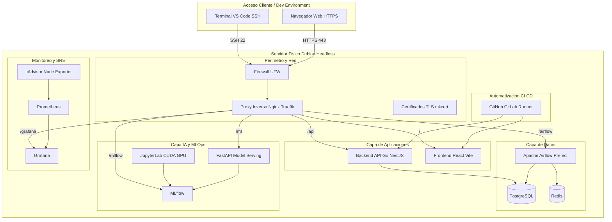

# 🚀 Debian Home Lab: Roadmap de Aprendizaje Integrado (Aprender Haciendo)

Este repositorio contiene la arquitectura de referencia, la planeación y la guía de implementación paso a paso para transformar una computadora de escritorio física en un servidor **Home Lab** de nivel empresarial con Debian Linux.

El objetivo principal es aprender e integrar **Administración de Sistemas (SysAdmin)**, **Ciberseguridad y DevSecOps**, **Desarrollo de Software Moderno**, **DevOps e IaC**, **Ingeniería de Datos**, **AI Engineering/MLOps** y **SRE/Observabilidad**.

---

## 🏛️ Arquitectura Conceptual del Sistema

A continuación se muestra cómo se interconectan todos los módulos y servicios una vez finalizado el roadmap:



---

## 📂 Estructura General del Proyecto

El proyecto está estructurado de manera flexible por módulos de especialidad. Dentro de cada módulo encontrarás una carpeta `/topicos` que sirve como tu espacio de estudio interactivo individual:

```bash
crimson-bloom-server/
│
├── README.md                          # Arquitectura global y roadmap estructurado (Este archivo)
├── CHECKLIST.md                       # Bitácora interactiva de control de progreso general
├── MEJORAS_APRENDIZAJE.md             # Propuesta metodológica y evolución de código
├── roadmaps_mapping.md                # Mapeo de correspondencia de los 34 PDFs de roadmaps
│
├── 0_SysAdmin_Redes/                  # MÓDULO 0: Debian Headless y Hardening
│   ├── README.md                      # Guía general, metas y tabla de troubleshooting del módulo
│   ├── validate.sh                    # Script bash para autocomprobar la seguridad local
│   ├── configs/                       # sshd_config y configuraciones de interfaces de red
│   ├── ejercicios/                    # Desafíos: Cambio de puertos, logs y scripts cron
│   └── topicos/                       # Espacio de estudio interactivo:
│       ├── 0.1_Instalacion_Debian_Redes.md
│       ├── 0.2_Permisos_Usuarios.md
│       ├── 0.3_Hardening_SSH.md
│       └── 0.4_Firewall_UFW.md
│
├── 1_Orquestacion_Enrutamiento/       # MÓDULO 1: Contenedores y Gateway Web
│   ├── README.md                      # Instrucciones de Docker y Proxy Reverso
│   ├── configs/                       # Plantillas de docker-compose.yml y nginx.conf
│   ├── ejercicios/                    # Desafíos: Ruteo whoami, control por IP y error pages
│   └── topicos/                       # Espacio de estudio interactivo:
│       ├── 1.1_Fundamentos_Docker.md
│       ├── 1.2_Orquestacion_Compose.md
│       ├── 1.3_Proxy_Inverso_Nginx.md
│       └── 1.4_Cifrado_SSL_TLS.md
│
├── 2_Desarrollo_CICD/                 # MÓDULO 2: Código fuente y automatización
│   ├── README.md                      # Arquitecturas de software y runners
│   ├── configs/                       # Dockerfiles multi-stage y runner yaml
│   ├── ejercicios/                    # Desafíos: Concurrencia, CDD React y Rollbacks
│   └── topicos/                       # Espacio de estudio interactivo:
│       ├── 2.1_Desarrollo_APIs.md
│       ├── 2.2_Frontend_CDD.md
│       ├── 2.3_Docker_MultiStage.md
│       └── 2.4_Agente_Runner_CICD.md
│
├── 3_Data_Engineering/                # MÓDULO 3: PostgreSQL, Redis y Airflow (ETL)
│   ├── README.md                      # Ingesta, limpieza y normalización
│   ├── configs/                       # Compose de Airflow + Postgres + Redis
│   ├── scripts/                       # Código de DAG en Python (sample_dag.py)
│   ├── ejercicios/                    # Desafíos: Dead Letter Queue, Backfill y TTLs
│   └── topicos/                       # Espacio de estudio interactivo:
│       ├── 3.1_Postgres_Redis.md
│       ├── 3.2_Orquestacion_Airflow.md
│       └── 3.3_Pipelines_ETL_Idempotentes.md
│
├── 4_AI_MLOps/                        # MÓDULO 4: Jupyter, MLflow y Serving
│   ├── README.md                      # Model Registry e inferencia en caliente
│   ├── scripts/                       # Scripts de entrenamiento y FastAPI serve
│   ├── ejercicios/                    # Desafíos: Shadow deploy y re-entrenamiento automático
│   └── topicos/                       # Espacio de estudio interactivo:
│       ├── 4.1_Jupyter_Feature_Engineering.md
│       ├── 4.2_Experimentacion_MLflow.md
│       └── 4.3_Model_Serving_FastAPI.md
│
└── 5_SRE_Observabilidad_Seguridad/    # MÓDULO 5: Prometheus, Grafana, Trivy y Lynis
    ├── README.md                      # Métricas de telemetría y escaneos de seguridad
    ├── configs/                       # prometheus.yml y compose de monitoreo
    ├── ejercicios/                    # Desafíos: Métricas custom, Alertmanager y Lynis hardening
    └── topicos/                       # Espacio de estudio interactivo:
        ├── 5.1_Metricas_Prometheus.md
        ├── 5.2_Visualizacion_Grafana.md
        └── 5.3_DevSecOps_Auditorias.md
```

---

## 🛠️ Herramientas de Control y Validadores

*   **[CHECKLIST.md](./CHECKLIST.md)**: Úsalo como tu registro de control en la raíz. Abre este archivo en tu editor local y marca con `[x]` a medida que completes cada hito conceptual y práctico del roadmap.
*   **[MEJORAS_APRENDIZAJE.md](./MEJORAS_APRENDIZAJE.md)**: Explica la metodología didáctica, el flujo iterativo del código, y la justificación detrás de las diferencias estructurales de cada módulo.
*   **[roadmaps_mapping.md](./roadmaps_mapping.md)**: Documenta el mapeo de los 34 PDFs oficiales de especialidad (Skill & Role Based) que se encuentran en `/roadmaps/` distribuidos entre cada módulo.
*   **[0_SysAdmin_Redes/validate.sh](./0_SysAdmin_Redes/validate.sh)**: Un script de automatización en Bash para correr con privilegios `sudo` directamente sobre tu nuevo servidor Debian Headless. Verifica automáticamente que las reglas de SSH y firewall sean correctas antes de que avances al Módulo 1.

---

## 📅 Resumen del Roadmap de Aprendizaje

### 🛡️ [Módulo 0: Cimientos del Servidor y Hardening](./0_SysAdmin_Redes/README.md)
*   **Objetivo:** Instalar Debian headless y asegurar el acceso remoto y de red a nivel de kernel y firewall.
*   **Tópicos Clave:**
    *   [0.1 Instalación y Redes Básicas](./0_SysAdmin_Redes/topicos/0.1_Instalacion_Debian_Redes.md)
    *   [0.2 Permisos y Administración de Usuarios](./0_SysAdmin_Redes/topicos/0.2_Permisos_Usuarios.md)
    *   [0.3 Hardening de OpenSSH](./0_SysAdmin_Redes/topicos/0.3_Hardening_SSH.md)
    *   [0.4 Seguridad Perimetral con UFW](./0_SysAdmin_Redes/topicos/0.4_Firewall_UFW.md)
*   **Proyecto Integrador:** Configurar Debian headless con IP estática local, crear un usuario no root con privilegios limitados, configurar llaves SSH Ed25519 prohibiendo contraseñas, y blindar accesos entrantes con UFW.
*   **Criterio de Éxito:** Al intentar acceder remotamente por SSH sin la llave privada Ed25519 correspondiente, el servidor rechaza inmediatamente la conexión (`Permission denied (publickey)`).

### 🐋 [Módulo 1: Aislamiento, Orquestación y Enrutamiento](./1_Orquestacion_Enrutamiento/README.md)
*   **Objetivo:** Levantar el motor de contenedores y crear un portal web unificado seguro (Proxy) como frontera del servidor.
*   **Tópicos Clave:**
    *   [1.1 Fundamentos de Contenedores Docker](./1_Orquestacion_Enrutamiento/topicos/1.1_Fundamentos_Docker.md)
    *   [1.2 Orquestación con Docker Compose](./1_Orquestacion_Enrutamiento/topicos/1.2_Orquestacion_Compose.md)
    *   [1.3 Proxy Inverso Nginx](./1_Orquestacion_Enrutamiento/topicos/1.3_Proxy_Inverso_Nginx.md)
    *   [1.4 Cifrado Seguro SSL/TLS](./1_Orquestacion_Enrutamiento/topicos/1.4_Cifrado_SSL_TLS.md)
*   **Proyecto Integrador:** Desplegar Docker y Compose. Inicializar un contenedor web estático aislado de la red pública y enrutar su tráfico HTTPS a través de un proxy inverso Nginx utilizando certificados de dominio local (`homelab.local`).
*   **Criterio de Éxito:** Al visitar `https://homelab.local` en tu máquina de desarrollo, la página se carga de forma segura mediante protocolo HTTPS y el puerto interno del contenedor no es accesible desde el exterior.

### ⚙️ [Módulo 2: Desarrollo e Integración Continua (CI/CD)](./2_Desarrollo_CICD/README.md)
*   **Objetivo:** Desarrollar servicios web a medida y automatizar su ciclo de vida y empaquetamiento en caliente.
*   **Tópicos Clave:**
    *   [2.1 APIs REST Concurrentes (Go / NestJS)](./2_Desarrollo_CICD/topicos/2.1_Desarrollo_APIs.md)
    *   [2.2 Component Driven Development React](./2_Desarrollo_CICD/topicos/2.2_Frontend_CDD.md)
    *   [2.3 Dockerfiles Multi-stage Optimistas](./2_Desarrollo_CICD/topicos/2.3_Docker_MultiStage.md)
    *   [2.4 Automatización con Runners locales](./2_Desarrollo_CICD/topicos/2.4_Agente_Runner_CICD.md)
*   **Proyecto Integrador:** Desarrollar una API REST y un frontend React/Vite. Desplegar un GitHub Actions Runner local en un contenedor e integrar un pipeline (`deploy.yml`) que compile imágenes multi-stage y redespliegue de forma autónoma al hacer `git push`.
*   **Criterio de Éxito:** Hacer un commit y push de código fuente desde tu PC cliente, ver cómo se ejecuta el workflow de GitHub Actions en tu runner local y constatar el cambio en vivo en `https://homelab.local/` de inmediato.

### 📊 [Módulo 3: Ingeniería de Datos y Pipelines ETL](./3_Data_Engineering/README.md)
*   **Objetivo:** Configurar bases de datos transaccionales de producción y automatizar la ingesta y deduplicación de flujos de datos.
*   **Tópicos Clave:**
    *   [3.1 Motores PostgreSQL y Redis](./3_Data_Engineering/topicos/3.1_Postgres_Redis.md)
    *   [3.2 Orquestación con Apache Airflow](./3_Data_Engineering/topicos/3.2_Orquestacion_Airflow.md)
    *   [3.3 Pipelines ETL Idempotentes](./3_Data_Engineering/topicos/3.3_Pipelines_ETL_Idempotentes.md)
*   **Proyecto Integrador:** Desplegar PostgreSQL y Redis. Configurar Apache Airflow y programar un DAG en Python que extraiga facturas de una fuente local/API, descarte duplicados en tiempo real mediante Redis y guarde los registros limpios en PostgreSQL.
*   **Criterio de Éxito:** Ver el flujo completarse con éxito en la UI de Airflow, verificar que no haya registros duplicados tras múltiples corridas, y consultar los datos ingestados en la base de datos SQL.

### 🤖 [Módulo 4: AI Engineering, Tracking y Serving (MLOps)](./4_AI_MLOps/README.md)
*   **Objetivo:** Diseñar, entrenar, versionar y poner a disposición de producción un modelo predictivo a partir de los datos históricos de facturación.
*   **Tópicos Clave:**
    *   [4.1 JupyterLab y Feature Engineering](./4_AI_MLOps/topicos/4.1_Jupyter_Feature_Engineering.md)
    *   [4.2 Experimentación y Registry con MLflow](./4_AI_MLOps/topicos/4.2_Experimentacion_MLflow.md)
    *   [4.3 Serving Síncrono mediante FastAPI](./4_AI_MLOps/topicos/4.3_Model_Serving_FastAPI.md)
*   **Proyecto Integrador:** Levantar JupyterLab y MLflow. Entrenar un modelo de clasificación de Scikit-Learn que prediga el nivel de riesgo de una factura, registrar parámetros e hiperparámetros en MLflow, y servir el modelo ganador mediante FastAPI expuesto bajo la ruta `https://homelab.local/ml/predict`.
*   **Criterio de Éxito:** Hacer un POST JSON con curl a tu endpoint de producción y recibir una predicción y probabilidad de riesgo válidas generadas por el modelo en menos de 100ms.

### 📈 [Módulo 5: SRE, Observabilidad y DevSecOps Avanzado](./5_SRE_Observabilidad_Seguridad/README.md)
*   **Objetivo:** Monitorear la infraestructura y rendimiento en caliente y auditar proactivamente la seguridad del servidor físico y lógico.
*   **Tópicos Clave:**
    *   [5.1 Recolección con Prometheus](./5_SRE_Observabilidad_Seguridad/topicos/5.1_Metricas_Prometheus.md)
    *   [5.2 Dashboards y Alertas en Grafana](./5_SRE_Observabilidad_Seguridad/topicos/5.2_Visualizacion_Grafana.md)
    *   [5.3 DevSecOps con Trivy y Lynis](./5_SRE_Observabilidad_Seguridad/topicos/5.3_DevSecOps_Auditorias.md)
*   **Proyecto Integrador:** Levantar Prometheus, Grafana, Node Exporter y cAdvisor. Exponer métricas de la API en el endpoint `/metrics`. Diseñar paneles gráficos de saturación en Grafana. Configurar escaneos estáticos de vulnerabilidades con Trivy en el pipeline CI/CD y correr Lynis para auditar el hardening de Debian.
*   **Criterio de Éxito:** Visualizar el estado de hardware de Debian en Grafana y verificar que el pipeline CI/CD bloquee un despliegue si se introduce una dependencia insegura calificada como CRITICAL.

---

## 🛠️ Guía de Comandos y Configuraciones Base

### 🐳 Docker Compose de Infraestructura General (`1_Orquestacion_Enrutamiento/configs/docker-compose.yml`)

```yaml
version: '3.8'

networks:
  homelab_network:
    driver: bridge

services:
  nginx-proxy:
    image: nginx:alpine
    container_name: nginx-proxy
    ports:
      - "80:80"
      - "443:443"
    volumes:
      - ./nginx.conf:/etc/nginx/nginx.conf:ro
      - ./certs:/etc/nginx/certs:ro
    networks:
      - homelab_network
    restart: always

  web-static:
    image: nginx:alpine
    container_name: web-static
    expose:
      - "80"
    volumes:
      - ./html:/usr/share/nginx/html:ro
    networks:
      - homelab_network
    restart: always
```

### 📋 Mapeo de Enrutamientos en Nginx (`nginx.conf` de referencia)

```nginx
events {
    worker_connections 1024;
}

http {
    include       /etc/nginx/mime.types;
    default_type  application/octet-stream;

    server {
        listen 80;
        server_name homelab.local;
        return 301 https://$host$request_uri;
    }

    server {
        listen 443 ssl;
        server_name homelab.local;

        ssl_certificate     /etc/nginx/certs/homelab.local.crt;
        ssl_certificate_key /etc/nginx/certs/homelab.local.key;
        ssl_protocols       TLSv1.2 TLSv1.3;
        ssl_ciphers         HIGH:!aNULL:!MD5;

        # Frontend (React + Vite)
        location / {
            proxy_pass http://web-static:80;
            proxy_set_header Host $host;
            proxy_set_header X-Real-IP $remote_addr;
            proxy_set_header X-Forwarded-For $proxy_add_x_forwarded_for;
        }

        # Backend API REST (Go o NestJS)
        location /api/ {
            proxy_pass http://api-backend:3000/;
            proxy_set_header Host $host;
            proxy_set_header X-Real-IP $remote_addr;
            proxy_set_header X-Forwarded-For $proxy_add_x_forwarded_for;
        }

        # Model Serving API (FastAPI)
        location /ml/ {
            proxy_pass http://ml-serving-api:8000/;
            proxy_set_header Host $host;
            proxy_set_header X-Real-IP $remote_addr;
        }
    }
}
```
